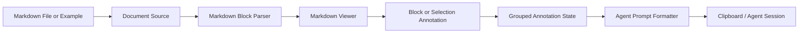

# Markdown Annotator

Markdown 문서를 화면에 렌더링하고, 사용자가 블록 또는 선택 영역에 annotation을 남긴 뒤, agent에게 전달할 수 있는 구조화된 Markdown prompt로 내보내는 Tauri 데스크톱 앱입니다.

Plannotator의 block 중심 annotation 흐름을 참고하여 Markdown block에 stable id와 source line 정보를 부여하고, annotation export에는 파일 경로, 목표, 사용자 지침, line range, 원본 Markdown context를 포함합니다.

## 주요 기능

- Markdown 예제 문서 선택
- Tauri 파일 다이얼로그로 로컬 Markdown 파일 열기
- 브라우저 실행 환경에서 `<input type="file">` fallback 지원
- Markdown block 단위 렌더링과 source line 추적
- 블록 단위 삭제 annotation
- 블록 단위 note annotation
- 선택 영역 단위 삭제 annotation
- 선택 영역 단위 note/change-request/question/approve annotation
- 여러 block에 걸친 선택 영역을 block별 segment로 분해하고 `groupId`로 묶어 관리
- group annotation을 한 번에 취소/삭제
- Agent prompt 목표 선택
- Agent prompt 사용자 지침 입력
- Agent prompt에 파일 경로, line range, 선택 영역, 원본 Markdown context 출력
- Agent prompt 클립보드 복사



## 사용 흐름

1. 예제 문서를 선택하거나 `Open` 버튼으로 Markdown 파일을 엽니다.
2. 문서 위에서 블록 버튼 또는 텍스트 선택 toolbar로 annotation을 추가합니다.
3. `Annotate` 탭에서 annotation 목록을 확인합니다.
4. `Prompt` 탭에서 목표와 사용자 지침, 파일 경로를 확인합니다.
5. 생성된 agent prompt를 복사해 Codex, Claude Code, OpenCode 같은 agent session에 전달합니다.

## CLI 사용법

Markdown Annotator는 Markdown 파일을 터미널에서 바로 여는 CLI를 제공합니다.

릴리즈/설치 환경에서는 `ma`를 사용합니다.

```bash
ma README.md
ma docs/annotation-architecture.md
```

`ma`는 앱 화면의 `Install CLI` 버튼이 설치하는 편의용 wrapper script입니다. 현재 실행 중인 앱 실행 파일에 Markdown 파일 경로를 전달합니다. 같은 파일이 이미 열려 있으면 새 창을 만들지 않고 기존 문서 창을 포커스합니다.

빌드 산출물로는 설명적인 이름의 `markdown-annotator-cli` 바이너리를 제공합니다.

```bash
cd apps/markdown-annotator/src-tauri
cargo build --bin markdown-annotator-cli
```

`markdown-annotator-cli`를 직접 실행해야 하는 경우에는 앱 실행 파일 탐색 순서에 따라 대상 앱을 찾습니다.

1. `MARKDOWN_ANNOTATOR_APP_PATH`
2. macOS 앱 번들의 sibling 실행 파일
3. `/Applications/Markdown Annotator.app/Contents/MacOS/markdown-annotator`

앱 화면의 `Install CLI` 버튼을 누르면 현재 실행 중인 앱을 가리키는 wrapper script를 `~/.local/bin/ma`에 설치합니다. 설치 후 `~/.local/bin`이 shell `PATH`에 포함되어 있어야 터미널에서 `ma`를 바로 실행할 수 있습니다.

개발 환경에서는 `ma-dev`를 사용합니다.

```bash
cd apps/markdown-annotator/src-tauri
cargo build --bin ma-dev
./target/debug/ma-dev ../../../README.md
```

`ma-dev`는 개발 산출물인 `target/debug/markdown-annotator`를 사용합니다. 실행 시 앱 바이너리를 먼저 빌드하고, `tauri.conf.json`의 `build.devUrl`에 지정된 Vite dev server가 실행 중이 아니면 `pnpm run dev`를 자동으로 시작합니다.

디버깅이 필요하면 `MA_VERBOSE=1`을 붙여 런처 로그를 확인할 수 있습니다.

```bash
MA_VERBOSE=1 ./target/debug/ma-dev ../../../README.md
```

## Agent Prompt

Prompt export는 agent가 실제 문서를 수정할 수 있도록 다음 정보를 포함합니다.

- `File`: 대상 파일 경로
- `목표`: 문서 수정, 검토 참고, 기타
- `사용자 지침`: 사용자가 입력한 추가 지시
- annotation type
- source line 또는 line range
- 선택 영역
- 원본 Markdown context
- change-request의 교체 지시
- delete의 삭제 대상

예시:

````md
# Markdown Annotations

File: /absolute/path/to/personal-notes-shopping-list.md
목표: 실행 가능한 annotation을 문서 수정 요청으로 반영합니다.
사용자 지침:
```text
수정 요청은 문서에 반영하고, note는 참고 정보로만 사용하세요.
```

이 Markdown 문서에 1개의 피드백이 있습니다:

## 1. [change-request] 선택 영역 변경
- 행: 21
- 원본 Markdown:
```markdown
- 양파 3개
```
- Offset: 0-5
- 선택 영역: "양파 3개"
- 선택 영역을 다음 내용으로 교체: 양파 10개
````

## 예제 문서

테스트용 예제는 [examples](./examples) 아래에 있습니다.

- [agent-review-plan.md](./examples/agent-review-plan.md)
- [product-requirements.md](./examples/product-requirements.md)
- [technical-design.md](./examples/technical-design.md)
- [personal-notes-shopping-list.md](./examples/personal-notes-shopping-list.md)

## 개발 환경

- Node.js / pnpm
- Rust toolchain
- Tauri v2
- Vite
- React
- shadcn/ui
- Storybook
- Turborepo

설치:

```bash
pnpm install
```

웹 개발 서버:

```bash
pnpm dev
```

Tauri 개발 앱:

```bash
pnpm tauri:dev
```

Storybook:

```bash
pnpm storybook
```

검증:

```bash
pnpm check-types
pnpm build
pnpm build-storybook
cd apps/markdown-annotator/src-tauri && cargo check
cd apps/markdown-annotator/src-tauri && cargo check --bin markdown-annotator-cli --bin ma-dev
```

## 앱 구조

프론트엔드는 `apps/markdown-annotator/src` 아래에서 Feature-Sliced Design을 따릅니다.

```text
src/
  app/        # 앱 조립과 전역 composition
  pages/      # 화면 단위 UI
  features/   # 사용자 액션과 비즈니스 interaction
  entities/   # domain model, API adapter, domain helper
  shared/     # 재사용 UI와 공통 유틸리티
  stories/    # Storybook stories
```

Tauri backend는 `apps/markdown-annotator/src-tauri/src` 아래에서 hexagonal architecture를 따릅니다.

```text
src-tauri/src/
  domain/          # 순수 domain model과 port
  application/     # use case와 business rule
  inbound/         # Tauri command 같은 inbound adapter
  infrastructure/  # filesystem 같은 outbound adapter
```

Tauri v2 capability와 permission 설정은 다음 경로에 있습니다.

```text
src-tauri/
  capabilities/default.json
  permissions/read-markdown-file.toml
```

## 디렉터리 구조

```text
markdown-annotator/
├── apps/
│   └── markdown-annotator/ # Tauri v2 + Vite + React desktop app
├── docs/
│   ├── annotation-architecture.md
│   └── plannotator/
├── examples/
├── package.json
├── pnpm-workspace.yaml
├── pnpm-lock.yaml
└── turbo.json
```

## 감사

이 프로젝트는 [Plannotator](https://github.com/backnotprop/plannotator)의 Markdown annotation workflow, block 중심 rendering, agent feedback export 흐름에서 영감을 받았고 구현 방향을 참고했습니다. 좋은 아이디어와 구조적 힌트를 제공한 Plannotator 프로젝트에 감사드립니다.
