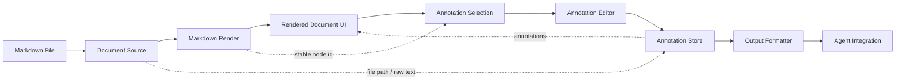
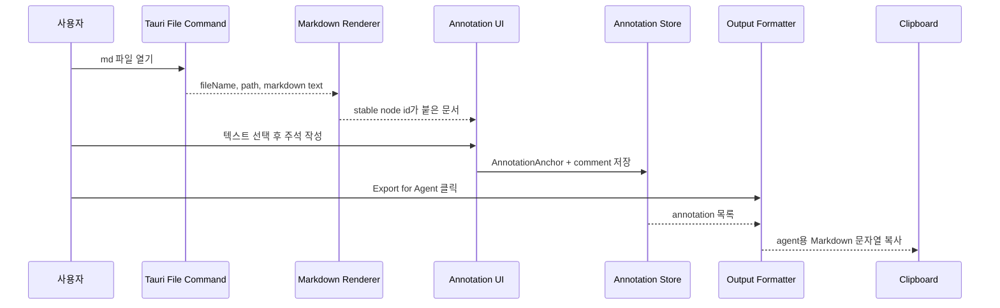

# Markdown Annotator 설계 조언

## 핵심 기준

좋은 기준은 **렌더링 / 선택·주석 / 결과 직렬화 / 파일·Agent 연동**을 분리하는 것입니다.

Plannotator도 Markdown 파일을 읽고, 브라우저 UI에서 annotation을 받은 뒤, structured output을 agent나 stdout으로 돌려주는 흐름을 갖습니다. 이 프로젝트도 처음부터 모든 agent 연동을 구현하기보다, 문서 모델과 annotation anchor를 안정적으로 잡고 그 위에 export와 adapter를 얹는 구조가 좋습니다.

가장 중요한 설계 원칙은 **annotation을 DOM에 직접 붙이지 않고, 문서 모델의 stable node id + offset에 붙이는 것**입니다. 이 원칙을 지키면 React 렌더링, Markdown 재파싱, agent 출력 포맷 변경에도 구조가 덜 흔들립니다.



## 권장 기능 영역

### 1. Document Source 영역

역할은 원본 Markdown 파일을 관리하는 것입니다.

담당 기능:

- 파일 열기
- 파일명, 절대경로, 상대경로 관리
- 원본 Markdown text 보관
- 변경 감지
- 파일별 annotation session 생성

이 영역은 로컬 파일 접근 권한이 필요한 Tauri 쪽이 적합합니다.

```text
src-tauri/
  commands/
    open_markdown_file
    read_file
    watch_file
```

### 2. Markdown Render 영역

역할은 Markdown을 안전한 HTML 또는 React render tree로 변환하는 것입니다.

담당 기능:

- Markdown parser
- code block, table, heading 지원
- HTML sanitize
- 각 block/inline 요소에 stable id 부여

Annotation을 안정적으로 유지하려면 DOM 위치만 믿으면 안 됩니다. Markdown AST 또는 자체 문서 모델에서 stable id를 만들고, 렌더링 결과에는 그 id를 속성으로 붙이는 방식이 좋습니다.

```html
<p data-node-id="p-12">
  ...
</p>
```

React 쪽 핵심 모듈:

```text
features/markdown-renderer/
  parseMarkdown.ts
  renderMarkdown.tsx
  nodeId.ts
```

### 3. Annotation Selection 영역

역할은 사용자가 문서 위에서 영역을 선택하는 기능을 담당하는 것입니다.

담당 기능:

- 텍스트 선택 감지
- 선택 범위의 anchor 저장
- block annotation / inline annotation 구분
- highlight 표시
- selection popover 표시

저장 포맷은 대략 다음처럼 두는 것이 좋습니다.

```ts
type AnnotationAnchor = {
  nodeId: string
  startOffset?: number
  endOffset?: number
  selectedText?: string
}
```

### 4. Annotation Editor 영역

역할은 주석 작성 UI를 제공하는 것입니다.

담당 기능:

- comment 입력
- severity/type 선택
- 수정/삭제
- thread 형태 확장 가능
- 저장 전 validation

```ts
type Annotation = {
  id: string
  fileName: string
  anchor: AnnotationAnchor
  comment: string
  type: "question" | "change-request" | "note" | "approve"
  createdAt: string
}
```

### 5. Annotation Store 영역

역할은 현재 문서의 annotation 상태를 관리하는 것입니다.

담당 기능:

- annotation 목록
- 선택된 annotation
- unsaved 상태
- undo/redo 가능성
- local persistence

Zustand 정도가 적합합니다.

```text
features/annotation-store/
  annotation.types.ts
  annotation.store.ts
  annotation.selectors.ts
```

### 6. Output Formatter 영역

역할은 agent에게 넘길 문자열이나 구조화 데이터를 생성하는 것입니다.

Plannotator의 핵심도 사용자의 markup을 structured feedback으로 agent session에 반환하는 데 있습니다. 처음에는 Markdown 문자열 출력만 해도 충분하고, 이후 JSON 출력을 추가하면 됩니다.

예시 출력:

```text
File: docs/plan.md
1. [change-request] "Use SQLite for local cache"
   Comment: Tauri 앱에서는 SQLite보다 filesystem JSON cache가 MVP에 더 단순합니다.
2. [question] "Agent integration"
   Comment: Codex/Claude/OpenCode 중 어떤 agent protocol을 우선 지원할지 명시해야 합니다.
```

모듈:

```text
features/export/
  formatForAgent.ts
  formatAsMarkdown.ts
  formatAsJson.ts
```

### 7. Agent Integration 영역

역할은 결과물을 agent에 전달하는 것입니다.

초기 MVP에서는 단순한 전달 방식으로 시작하는 것이 좋습니다.

- 클립보드 복사
- 파일로 저장
- stdout 출력
- command line argument로 반환

확장 시에는 agent별 adapter를 둡니다.

```text
integrations/
  clipboard/
  local-file/
  claude-code/
  codex/
  opencode/
```

Plannotator는 Claude Code, Codex, OpenCode 등 여러 harness를 지원하는 방향으로 확장되어 있습니다. 이 프로젝트에서는 처음부터 모두 붙이지 말고 Agent Adapter 인터페이스만 만들어두는 편이 좋습니다.

```ts
interface AgentAdapter {
  name: string
  submitFeedback(payload: AnnotationExport): Promise<void>
}
```

## 추천 디렉터리 구조

```text
src/
  app/
    App.tsx
    routes.tsx
  features/
    document-source/
    markdown-renderer/
    annotation-selection/
    annotation-editor/
    annotation-store/
    export/
    agent-integration/
  components/
    MarkdownViewer.tsx
    AnnotationSidebar.tsx
    AnnotationPopover.tsx
    Toolbar.tsx
  shared/
    types/
    utils/
src-tauri/
  commands/
    file.rs
    export.rs
  state/
```

## MVP 범위

처음 버전은 다음 범위로 자르는 것을 추천합니다.

1. Markdown 파일 열기
2. Markdown을 HTML 또는 React render tree로 렌더링
3. 텍스트 선택 후 annotation 추가
4. 우측 sidebar에 annotation 목록 표시
5. `Export for Agent` 버튼 제공
6. 파일명 + annotation 문자열 생성
7. 클립보드 복사



## 이후 확장

- HTML 파일 annotation
- URL annotation
- 폴더 단위 문서 annotation
- diff annotation
- agent별 submit adapter
- annotation history
- plan version diff

## 설계상 주의점

DOM Range만 저장하면 Markdown 재렌더링, sanitize, heading 재계산, table 구조 변경 같은 상황에서 annotation 위치가 쉽게 깨질 수 있습니다. 따라서 selection 결과는 DOM 자체가 아니라 `nodeId`, `startOffset`, `endOffset`, `selectedText` 같은 문서 모델 기준 anchor로 변환해 저장해야 합니다.

또한 export formatter와 agent integration은 분리해야 합니다. Formatter는 "무엇을 보낼지"를 만들고, adapter는 "어디로 보낼지"만 담당해야 합니다. 이 경계를 지키면 MVP에서는 클립보드 복사만 제공하더라도 이후 Codex, Claude Code, OpenCode adapter를 추가하기 쉬워집니다.
