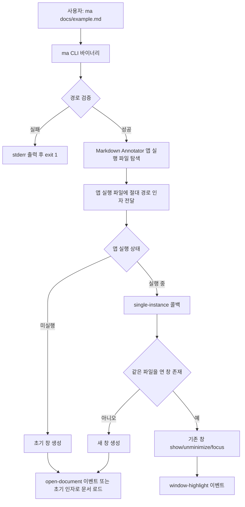
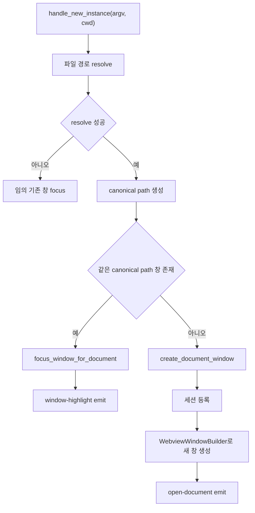
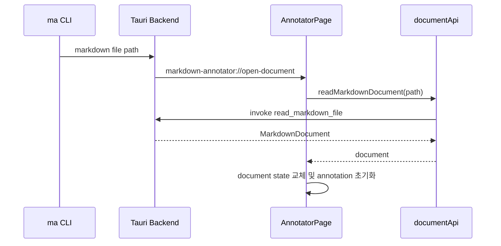

# Markdown Annotator CLI 파일 열기 기능 계획

## 현재 멀티 윈도우 구현과의 관계

이 문서는 후속 CLI 작업 계획이다. 현재 앱에는 이미 native window/tab 기반 문서 열기 command가 구현되어 있다.

- `request_open_document_window`: 독립 native window로 문서를 연다.
- `request_open_document_tab`: 현재 window의 macOS native tab group에 문서를 붙인다.
- `read_markdown_file`: query path 또는 선택된 path의 Markdown 내용을 읽는다.

CLI 구현은 새 window/session 모델을 다시 만들지 않고, 앱 실행 인자를 위 command 흐름과 같은 path 검증, deterministic window label, 기존 window focus 정책에 연결한다.

## 목표

`markdown-annotator`에 CLI 명령어 `ma <filename>`을 추가한다. 사용자는 터미널에서 Markdown 파일 경로를 넘겨 앱을 실행하거나, 이미 열린 앱 창을 전면으로 가져올 수 있어야 한다.

핵심 동작은 다음과 같다.

- 앱이 실행 중이 아니면 `ma <filename>`이 새 앱 창을 열고 해당 Markdown 파일을 로드한다.
- 앱이 실행 중이고 같은 파일이 이미 열린 창이 있으면 새 창을 만들지 않고 기존 창을 하이라이트하고 포커스한다.
- 앱이 실행 중이고 다른 파일이면 새 창을 열어 해당 파일을 로드한다.
- 잘못된 경로 또는 Markdown이 아닌 파일은 CLI에서 오류를 출력하고 종료한다.

## 참고 구현

`~/project/markmini`는 `src-tauri/src/bin/mm.rs`에 별도 CLI 바이너리를 두고, CLI가 실제 Tauri 앱 실행 파일을 찾아 파일 경로를 인자로 전달한다. 앱 쪽은 `tauri-plugin-single-instance`로 두 번째 실행 요청을 받아 기존 창 포커스 또는 새 창 생성을 처리한다.

`markdown-annotator`도 같은 방향을 따른다. 다만 현재 앱은 단일 문서 annotation 화면 중심이고, 백엔드는 `domain`, `application`, `inbound`, `infrastructure`로 나뉘어 있으므로 창 관리와 파일 로드 요청을 Tauri 의존 코드에만 묶고 도메인은 순수하게 유지한다.

## 전체 흐름



## 구현 단계

### 1. CLI 바이너리 추가

파일 위치:

- `apps/markdown-annotator/src-tauri/src/bin/ma.rs`

역할:

- `ma <filename>` 인자를 읽는다.
- 상대 경로는 CLI 실행 시점의 현재 작업 디렉터리 기준으로 절대 경로화한다.
- `canonicalize`로 실제 파일 존재 여부를 확인한다.
- 허용 확장자는 우선 `md`, `markdown`, `mdx`로 둔다.
- 앱 실행 파일을 찾아 절대 파일 경로를 인자로 넘긴다.

앱 실행 파일 탐색 우선순위:

1. `MARKDOWN_ANNOTATOR_APP_PATH` 환경 변수
2. CLI 바이너리와 같은 디렉터리 또는 macOS bundle sibling path
3. `/Applications/Markdown Annotator.app/Contents/MacOS/markdown-annotator`

오류 정책:

- 파일이 없으면 `ma: failed to resolve ...` 출력
- Markdown 파일이 아니면 `ma: target must be a markdown file ...` 출력
- 앱 실행 파일을 찾지 못하면 환경 변수 설정 안내 출력

### 2. Tauri 단일 인스턴스 연결

`apps/markdown-annotator/src-tauri/Cargo.toml`에 의존성을 추가한다.

```toml
tauri-plugin-single-instance = "2"
```

`apps/markdown-annotator/src-tauri/src/lib.rs`에서 플러그인을 등록한다.

```rust
.plugin(tauri_plugin_single_instance::init(|app, argv, cwd| {
    handle_new_instance(app, argv, cwd);
}))
```

첫 실행과 두 번째 실행 모두 같은 파일 경로 해석 로직을 사용한다.

### 3. 창 세션 상태 추가

현재 프론트엔드가 문서 상태를 로컬 React state로 들고 있으므로, 백엔드에는 최소한의 창-파일 매핑만 둔다.

```rust
struct AppState {
    windows: Mutex<HashMap<String, WindowSession>>,
    window_counter: AtomicU32,
}

struct WindowSession {
    document_path: PathBuf,
    canonical_document_path: PathBuf,
}
```

책임 분리:

- `domain`: Markdown 문서 모델과 파일 읽기 port 유지
- `application`: 파일 경로 검증, 창 세션 조회에 필요한 순수 로직 배치
- `inbound`: Tauri command, Tauri event, window 생성 및 focus 처리
- `infrastructure`: 파일 시스템 기반 Markdown reader 유지

## 백엔드 창 처리



필요 함수 후보:

- `resolve_document_path(raw_arg: Option<&str>, cwd: &Path) -> Result<PathBuf, String>`
- `find_window_for_document(app: &AppHandle, path: &Path) -> Option<String>`
- `focus_window(app: &AppHandle, label: &str)`
- `create_document_window(app: &AppHandle, path: PathBuf)`
- `register_window_session(label: String, path: PathBuf)`
- `cleanup_window(window: &tauri::Window)`

창 label 예:

- 기본 창: `main`
- CLI로 추가 생성된 창: `annotator-1`, `annotator-2`

## 프론트엔드 이벤트 처리

이벤트 이름:

- `markdown-annotator://open-document`
- `markdown-annotator://window-highlight`

payload:

```ts
type OpenDocumentPayload = {
  path: string;
};
```

추가 위치 후보:

- `apps/markdown-annotator/src/entities/document/api/documentApi.ts`
- `apps/markdown-annotator/src/features/open-document/listenToDocumentOpenRequests.ts`
- `apps/markdown-annotator/src/pages/annotator/AnnotatorPage.tsx`

`open-document` 이벤트 처리 시 기존 `readMarkdownDocument(path)`를 재사용한다.

문서 교체 시 초기화할 상태:

- `annotations`
- selection 관련 state
- note dialog
- editing annotation
- `promptFilePath`
- status text

`window-highlight` 이벤트 처리:

- 기존 창이 전면으로 올라왔음을 사용자가 인지할 수 있도록 짧은 강조 상태를 둔다.
- 예: 문서 패널 ring 또는 status 영역 강조를 800ms 정도 표시한다.

## 프론트엔드 상태 흐름



## CLI 설치 기능

1차 구현에서는 Rust bin target으로 `ma`가 빌드되도록 만드는 것을 우선한다.

앱 안에서 CLI 설치 버튼까지 제공하려면 후속으로 다음 command를 추가한다.

- `install_cli`
- `check_cli_installed`

설치 위치 후보:

- `~/bin/ma`
- `~/.local/bin/ma`

macOS 사용자 환경에서는 shell `PATH`에 설치 위치가 들어있는지 안내가 필요하다.

## 검증 계획

Rust 검증:

```bash
cd apps/markdown-annotator/src-tauri
cargo check
```

TypeScript 검증:

```bash
pnpm --filter @yoophi/markdown-annotator check-types
```

수동 검증:

1. 앱이 꺼진 상태에서 `ma README.md`를 실행하면 새 창에 문서가 열린다.
2. 같은 파일에 대해 `ma README.md`를 다시 실행하면 기존 창이 포커스되고 하이라이트된다.
3. 다른 파일에 대해 `ma docs/sample.md`를 실행하면 새 창이 열린다.
4. 존재하지 않는 파일을 넘기면 CLI가 오류를 출력하고 종료 코드 1로 끝난다.
5. Markdown이 아닌 파일을 넘기면 CLI가 오류를 출력하고 종료 코드 1로 끝난다.
6. 파일 열기 버튼으로 연 문서와 CLI로 연 문서가 같은 `MarkdownDocument` 모델을 사용한다.

## 위험 요소와 대응

| 위험 요소 | 대응 |
| --- | --- |
| 프론트가 이벤트를 구독하기 전에 백엔드가 `open-document`를 emit할 수 있음 | 초기 실행 인자는 백엔드 세션에 저장하고, 프론트가 `get_initial_document_request` command로 한 번 조회하는 보완책을 둔다. |
| 같은 파일 판정이 상대 경로 차이로 실패할 수 있음 | 백엔드에서 항상 `canonicalize` 결과로 비교한다. |
| 창 label 충돌 가능성 | `AtomicU32` 기반 counter로 label 생성 후 세션 등록 전에 중복을 확인한다. |
| 도메인이 Tauri 타입에 의존할 수 있음 | 창 생성, focus, emit은 `inbound` 또는 Tauri adapter에만 둔다. |
| CLI 설치 위치가 사용자 PATH에 없을 수 있음 | 설치 command 결과에 설치 경로와 PATH 안내 문구를 포함한다. |

## 권장 작업 순서

1. `ma.rs` CLI 런처를 추가한다.
2. 백엔드에 파일 경로 resolve 유틸과 창 세션 상태를 추가한다.
3. `tauri-plugin-single-instance`를 연결한다.
4. 기존 창 포커스와 새 창 생성 로직을 구현한다.
5. 프론트엔드에서 `open-document`, `window-highlight` 이벤트를 구독한다.
6. 타입체크와 `cargo check`를 통과시킨다.
7. 수동으로 CLI 실행 시나리오를 검증한다.
8. 필요하면 앱 내부 CLI 설치 command와 UI를 추가한다.
