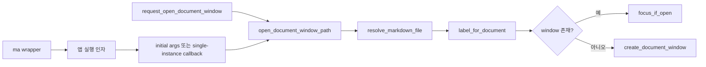
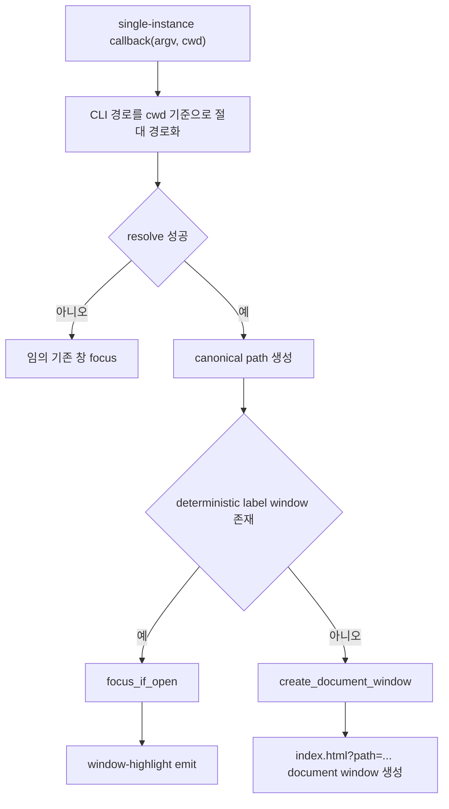
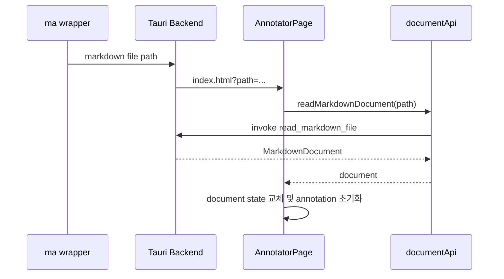

# Markdown Annotator CLI 파일 열기 기능

## 현재 멀티 윈도우 구현과의 관계

이 문서는 CLI 파일 열기 기능의 구현 내용을 정리한다. 앱에는 이미 native window/tab 기반 문서 열기 command가 구현되어 있으며, CLI는 그 흐름을 재사용한다.

- `request_open_document_window`: 독립 native window로 문서를 연다.
- `request_open_document_tab`: 현재 window의 macOS native tab group에 문서를 붙인다.
- `read_markdown_file`: query path 또는 선택된 path의 Markdown 내용을 읽는다.

CLI 구현은 새 window/session 모델을 만들지 않고, 앱 실행 인자를 위 command 흐름과 같은 path 검증, deterministic window label, 기존 window focus 정책에 연결한다.

## 목표

`markdown-annotator`에 Markdown 파일을 터미널에서 여는 CLI 흐름을 추가한다. 사용자가 직접 사용하는 편의 명령은 앱이 설치하는 `ma <filename>` wrapper이고, Rust 빌드 산출물은 의미가 명확한 `markdown-annotator-cli` 바이너리로 분리한다.

핵심 동작은 다음과 같다.

- 앱이 실행 중이 아니면 `ma <filename>` wrapper가 새 앱 창을 열고 해당 Markdown 파일을 로드한다.
- 앱이 실행 중이고 같은 파일이 이미 열린 창이 있으면 새 창을 만들지 않고 기존 창을 하이라이트하고 포커스한다.
- 앱이 실행 중이고 다른 파일이면 새 창을 열어 해당 파일을 로드한다.
- 잘못된 경로 또는 Markdown이 아닌 파일은 CLI에서 오류를 출력하고 종료한다.

## 참고 구현

`~/project/markmini`는 `src-tauri/src/bin/mm.rs`에 별도 CLI 바이너리를 두고, CLI가 실제 Tauri 앱 실행 파일을 찾아 파일 경로를 인자로 전달한다. 앱 쪽은 `tauri-plugin-single-instance`로 두 번째 실행 요청을 받아 기존 창 포커스 또는 새 창 생성을 처리한다.

`markdown-annotator`도 같은 방향을 따른다. 다만 현재 앱은 단일 문서 annotation 화면 중심이고, 백엔드는 `domain`, `application`, `inbound`, `infrastructure`로 나뉘어 있으므로 창 관리와 파일 로드 요청을 Tauri 의존 코드에만 묶고 도메인은 순수하게 유지한다.

## 전체 흐름


## 구현 단계

### 1. CLI 런처 추가

파일 위치:

- `apps/markdown-annotator/src-tauri/src/bin/markdown-annotator-cli.rs`
- `apps/markdown-annotator/src-tauri/src/bin/ma-dev.rs`
- `apps/markdown-annotator/src-tauri/src/cli_launcher.rs`

역할:

- `markdown-annotator-cli <filename>` 또는 `ma-dev <filename>` 인자를 읽는다.
- 상대 경로는 CLI 실행 시점의 현재 작업 디렉터리 기준으로 절대 경로화한다.
- `canonicalize`로 실제 파일 존재 여부를 확인한다.
- 허용 확장자는 우선 `md`, `markdown`, `mdx`로 둔다.
- 앱 실행 파일을 찾아 canonical 파일 경로를 인자로 넘긴다.

릴리즈용 빌드 산출물 `markdown-annotator-cli`의 앱 실행 파일 탐색 우선순위:

1. `MARKDOWN_ANNOTATOR_APP_PATH` 환경 변수
2. macOS bundle sibling path
3. `/Applications/Markdown Annotator.app/Contents/MacOS/markdown-annotator`

릴리즈용 `markdown-annotator-cli`는 Vite dev server를 시작하지 않고, `target/debug/markdown-annotator`도 자동 탐색하지 않는다. 설치된 앱 또는 명시적인 `MARKDOWN_ANNOTATOR_APP_PATH`만 대상으로 한다.

사용자가 터미널에서 실행하는 `ma`는 앱 내부 `Install CLI` command가 `~/.local/bin/ma`에 설치하는 wrapper script다. 이 script는 설치 시점의 앱 실행 파일을 직접 가리키므로 빌드 산출물 이름과 사용자 명령 이름이 충돌하지 않는다.

개발용 `ma-dev`의 앱 실행 파일 탐색 우선순위:

1. `MARKDOWN_ANNOTATOR_APP_PATH` 환경 변수
2. `ma-dev`와 같은 `target/debug` 디렉터리의 `markdown-annotator`

개발용 `ma-dev`는 `tauri.conf.json`의 `build.devUrl`을 읽고, 해당 dev server가 열려 있지 않으면 앱 package directory에서 `pnpm run dev`를 먼저 시작한 뒤 debug 앱 실행 파일을 띄운다. Vite에는 `build.devUrl`의 port를 `VITE_DEV_SERVER_PORT`로 넘겨 Tauri 설정과 dev server port를 맞춘다.

또한 `target/debug/markdown-annotator`가 없거나 `ma-dev`보다 오래된 경우에는 `cargo build --bin markdown-annotator`를 먼저 실행한다. 이렇게 해야 `ma-dev`만 새로 빌드되고 실제 앱 바이너리는 오래된 상태로 남아 문서 인자 처리가 누락되는 문제를 피할 수 있다.

오류 정책:

- 파일이 없으면 `ma: failed to resolve ...` 출력
- Markdown 파일이 아니면 `ma: target must be a markdown file ...` 출력
- 앱 실행 파일을 찾지 못하면 환경 변수 설정 안내 출력

### 2. Tauri 단일 인스턴스 연결

`apps/markdown-annotator/src-tauri/Cargo.toml`에 의존성을 추가한다.

```toml
tauri-plugin-single-instance = "2"
```

`apps/markdown-annotator/src-tauri/src/lib.rs`에서 플러그인을 등록한다.

```rust
.plugin(tauri_plugin_single_instance::init(|app, argv, cwd| {
    handle_new_instance(app, argv, cwd);
}))
```

첫 실행과 두 번째 실행 모두 같은 파일 경로 해석 로직을 사용한다.

### 3. 기존 document window 흐름 재사용

현재 구현은 별도 창 세션 상태를 추가하지 않는다. canonical path를 기준으로 deterministic window label을 만들고, 같은 label의 window가 이미 있으면 `show`, `unminimize`, `set_focus`를 호출한다.

책임 분리:

- `domain`: Markdown 문서 모델과 파일 읽기 port 유지
- `application`: Markdown 파일 읽기 use case 유지
- `inbound`: Tauri command, single-instance callback, window 생성 및 focus 처리
- `infrastructure`: 파일 시스템 기반 Markdown reader 유지

## 백엔드 창 처리

CLI와 UI command는 모두 `open_document_window_path`로 합류한다.





주요 함수:

- `open_document_from_cli_args(app: &AppHandle, argv: &[String], cwd: &Path) -> Result<bool, String>`
- `open_document_window_path(app: &AppHandle, path: &str) -> Result<(), String>`
- `resolve_markdown_file(raw_path: &str) -> Result<PathBuf, String>`
- `label_for_document(path: &Path) -> String`
- `focus_if_open(app: &AppHandle, label: &str) -> bool`
- `create_document_window(app: &AppHandle, label: &str, path: &Path)`

창 label 예:

- 기본 창: `main`
- 문서 창: `document-{canonical-path-hash}`

## 프론트엔드 이벤트 처리

CLI 파일 열기는 프론트엔드에 새 이벤트를 추가하지 않는다. Tauri backend가 `index.html?path=...` URL로 document window를 만들고, 기존 `AnnotatorPage`가 query string의 `path`를 읽어 `readMarkdownDocument(path)`를 호출한다.

유지되는 이벤트 이름:

- `markdown-annotator://window-highlight`

문서 window 생성 시 기존 query path 로딩에서 초기화할 상태:

- `annotations`
- selection 관련 state
- note dialog
- editing annotation
- `promptFilePath`
- status text

`window-highlight` 이벤트 처리:

- 기존 창이 전면으로 올라왔음을 사용자가 인지할 수 있도록 짧은 강조 상태를 둔다.
- 예: 문서 패널 ring 또는 status 영역 강조를 800ms 정도 표시한다.

## 프론트엔드 상태 흐름



## CLI 설치 기능

앱 안에서 `Install CLI` 버튼으로 사용자 편의 명령인 `ma` wrapper script를 설치한다.

Tauri command:

- `install_cli`
- `check_cli_installed`

설치 위치:

- `~/.local/bin/ma`

설치 script는 현재 실행 중인 앱 바이너리를 고정 경로로 가리킨다. macOS 사용자 환경에서는 shell `PATH`에 `~/.local/bin`이 들어있는지 안내가 필요하다.

## 검증 계획

Rust 검증:

```bash
cd apps/markdown-annotator/src-tauri
cargo check
cargo check --bin markdown-annotator-cli
cargo check --bin ma-dev
```

TypeScript 검증:

```bash
pnpm --filter @yoophi/markdown-annotator check-types
```

수동 검증:

1. 앱이 꺼진 상태에서 `ma README.md`를 실행하면 새 창에 문서가 열린다.
2. 같은 파일에 대해 `ma README.md`를 다시 실행하면 기존 창이 포커스되고 하이라이트된다.
3. 다른 파일에 대해 `ma docs/sample.md`를 실행하면 새 창이 열린다.
4. 존재하지 않는 파일을 넘기면 CLI가 오류를 출력하고 종료 코드 1로 끝난다.
5. Markdown이 아닌 파일을 넘기면 CLI가 오류를 출력하고 종료 코드 1로 끝난다.
6. 파일 열기 버튼으로 연 문서와 CLI로 연 문서가 같은 `MarkdownDocument` 모델을 사용한다.
7. `markdown-annotator-cli`는 설치 앱이 없고 `MARKDOWN_ANNOTATOR_APP_PATH`도 없으면 오류를 출력하고 종료 코드 1로 끝난다.
8. `ma-dev`는 `target/debug/markdown-annotator`와 Vite dev server를 개발용으로 사용한다.

실제 GUI 실행 없이 런처 success path를 검증할 때는 다음처럼 앱 실행 파일을 대체할 수 있다.

```bash
MARKDOWN_ANNOTATOR_APP_PATH=/usr/bin/true cargo run --bin markdown-annotator-cli -- ../../../README.md
```

개발 산출물을 직접 검증할 때는 다음 명령을 사용할 수 있다.

```bash
./apps/markdown-annotator/src-tauri/target/debug/ma-dev AGENTS.md
```

## 위험 요소와 대응

| 위험 요소 | 대응 |
| --- | --- |
| 프론트가 이벤트를 구독하기 전에 백엔드가 `open-document`를 emit할 수 있음 | 이벤트 emit 대신 `index.html?path=...`로 document window를 만들기 때문에 초기 구독 순서에 의존하지 않는다. |
| 같은 파일 판정이 상대 경로 차이로 실패할 수 있음 | 백엔드에서 항상 `canonicalize` 결과로 비교한다. |
| 창 label 충돌 가능성 | canonical path hash 기반 deterministic label을 사용한다. |
| 도메인이 Tauri 타입에 의존할 수 있음 | 창 생성, focus, emit은 `inbound` 또는 Tauri adapter에만 둔다. |
| CLI 설치 위치가 사용자 PATH에 없을 수 있음 | 릴리즈 설치 command 결과에 `ma` 설치 경로와 PATH 안내 문구를 포함한다. |
| 개발용 특수 처리가 릴리즈 CLI에 섞일 수 있음 | `ma-dev`와 `markdown-annotator-cli`를 별도 bin target으로 나누고, dev server 시작은 `ma-dev`에만 둔다. |

## 권장 작업 순서

1. `markdown-annotator-cli.rs`, `ma-dev.rs`, `cli_launcher.rs` 런처를 추가한다.
2. 백엔드에 파일 경로 resolve 유틸과 CLI 인자 처리 함수를 추가한다.
3. `tauri-plugin-single-instance`를 연결한다.
4. 기존 창 포커스와 새 창 생성 로직을 구현한다.
5. 기존 프론트엔드의 query path 로딩과 `window-highlight` 이벤트 구독을 재사용한다.
6. 타입체크와 `cargo check`를 통과시킨다.
7. 수동으로 CLI 실행 시나리오를 검증한다.
8. 필요하면 앱 내부 CLI 설치 command와 UI를 추가한다.
