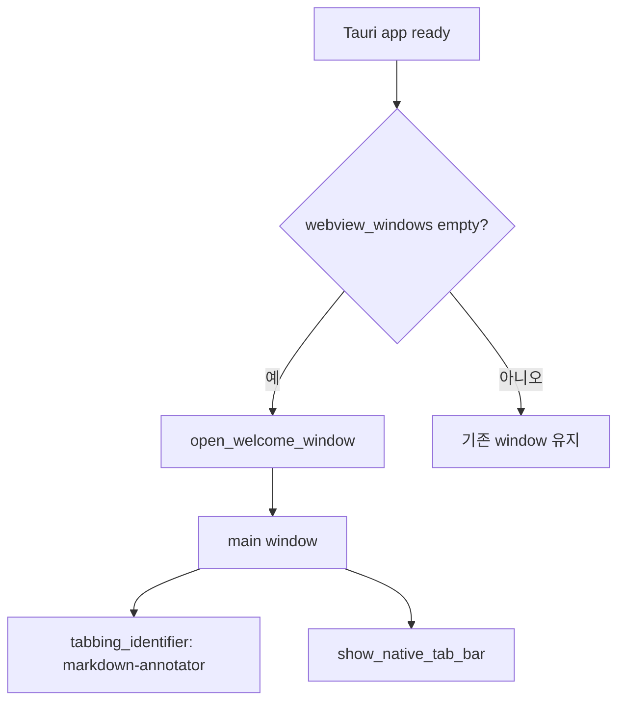
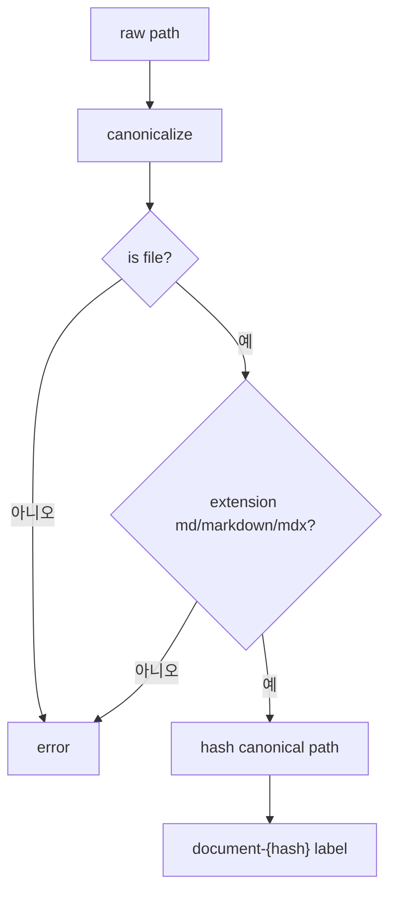
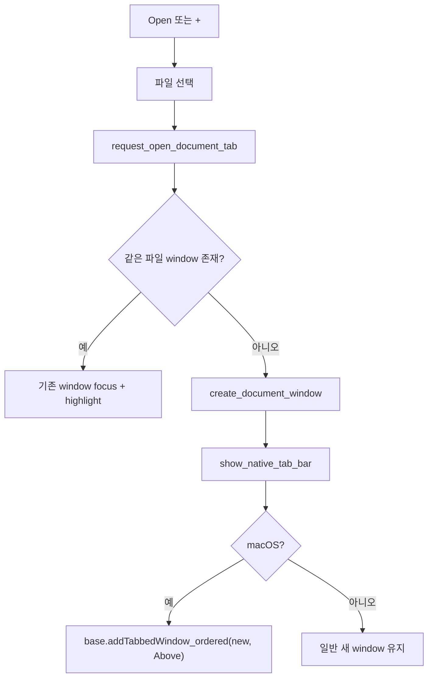
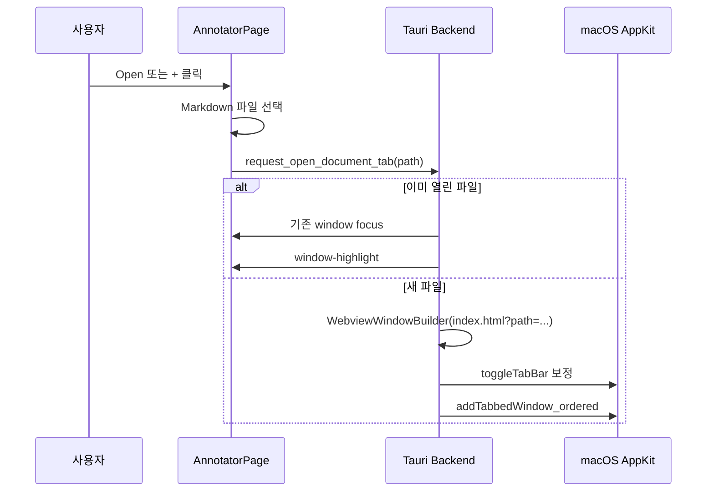

# Markdown Annotator 멀티 윈도우 구현 문서

## 목표

`markdown-annotator`는 Tauri native window를 사용해 Markdown 문서를 창 또는 macOS native tab으로 연다. 같은 파일을 다시 열면 새 창을 만들지 않고 기존 문서 창을 포커스하고 하이라이트한다.

CLI 명령어 `ma <filename>`은 아직 포함하지 않는다. CLI는 후속 작업에서 현재 구현된 window/tab command를 재사용한다.

## 현재 구현 범위

- 정적 Tauri window 설정을 제거하고 Rust에서 window를 생성한다.
- 앱 시작 시 열린 창이 없으면 `main` welcome window를 생성한다.
- `main`과 모든 문서 window에 macOS `tabbing_identifier("markdown-annotator")`를 부여한다.
- 파일 경로는 canonical path로 정규화하고 hash 기반 deterministic label을 만든다.
- 문서 window는 `index.html?path=<encoded-path>`로 열리며, 프론트는 query의 `path`를 읽어 문서를 로드한다.
- `Open` 버튼은 현재 window의 native tab group에 문서를 붙이는 경로를 사용한다.
- 이미 열린 문서 경로를 다시 열면 기존 window를 `show`, `unminimize`, `set_focus` 하고 `window-highlight` 이벤트를 보낸다.
- macOS에서는 단일 native tab bar도 보이도록 `NSWindow.toggleTabBar(None)` 보정 호출을 수행한다.

## 제외 범위

- CLI 바이너리와 CLI 설치 UI
- 여러 문서를 하나의 webview 안에서 전환하는 브라우저식 tab state
- annotation 영구 저장/복원
- 파일 변경 감지와 자동 reload
- `Cmd+T` native menu accelerator

## 백엔드 구조

### Entry Point

`tauri.conf.json`의 `app.windows`는 빈 배열이다. 앱은 `RunEvent::Ready`에서 열린 window가 없을 때 `open_welcome_window`를 호출한다.



### Commands

현재 등록된 command:

- `read_markdown_file(path: String)`
- `request_open_document_window(path: String)`
- `request_open_document_tab(path: String, window: WebviewWindow)`

역할:

- `request_open_document_window`: 문서를 독립 native window로 연다.
- `request_open_document_tab`: 문서를 새 native window로 만든 뒤 현재 window의 macOS tab group에 붙인다.
- 두 command 모두 같은 파일이 이미 열려 있으면 새 window를 만들지 않고 기존 window를 포커스한다.

### Path와 Label

Markdown 파일은 다음 순서로 처리한다.



같은 파일은 항상 같은 window label을 갖는다. 따라서 `app.get_webview_window(label)`로 중복 window를 판별한다.

### Window 생성

새 문서 window는 다음 URL로 생성한다.

```text
index.html?path=<percent-encoded-canonical-path>
```

macOS에서는 생성된 window에 다음 동작을 적용한다.

- `tabbing_identifier("markdown-annotator")`
- `show_native_tab_bar(window)`

`show_native_tab_bar`는 `NSWindow.tabGroup().isTabBarVisible()`를 확인하고, 보이지 않으면 `toggleTabBar(None)`를 호출한다.

### Native Tab Attach

`request_open_document_tab`은 새 문서 window를 만든 뒤 현재 window에 붙인다.



탭이 분리되어 단일 window가 된 경우에도 `show_native_tab_bar` 보정이 적용되어 native tab bar를 표시하도록 시도한다. 이 탭 바를 드래그해 다른 window로 병합할 수 있다.

## 프론트엔드 구조

### 문서 로딩

`AnnotatorPage`는 mount 시 `window.location.search`에서 `path`를 읽는다.

- `path`가 있으면 `readMarkdownDocument(path)`를 호출한다.
- 문서 로드 후 annotation, selection, dialog 상태를 초기화한다.
- `path`가 없으면 예제 문서 상태로 시작한다.

### 파일 열기

- `Open` 버튼: `openMarkdownDocumentTab()`
- 브라우저/Storybook 환경: 현재 페이지에 파일을 로드하는 fallback 유지

`openMarkdownDocumentTab()`은 Tauri 런타임에서 파일 dialog를 열고 `request_open_document_tab`을 호출한다.

### Native Tab Bar

macOS native tab bar가 문서 이동과 병합/분리의 유일한 탭 UI다.

역할:

- 단일 window에서도 tab bar를 표시해 현재 창을 다른 window로 드래그 병합할 수 있게 한다.
- 여러 문서가 같은 tab group에 있을 때 OS 기본 탭 UI로 전환한다.
- 탭 분리와 병합은 AppKit/운영체제 동작에 맡긴다.

구현:

- 모든 Markdown Annotator window에 `tabbing_identifier("markdown-annotator")`를 지정한다.
- window 생성 직후 `show_native_tab_bar(window)`를 호출한다.
- 기존 window를 포커스할 때도 `show_native_tab_bar(window)`를 다시 호출한다.
- `show_native_tab_bar`는 `NSWindow.tabGroup().isTabBarVisible()`를 확인하고, 보이지 않으면 `toggleTabBar(None)`를 호출한다.

## 사용자 흐름



## 검증

자동 검증:

```bash
pnpm --filter @yoophi/markdown-annotator check-types
pnpm --filter @yoophi/markdown-annotator build
cd apps/markdown-annotator/src-tauri && cargo check
```

수동 검증:

1. 앱을 실행한다.
2. welcome window에서도 native tab bar가 표시되는지 확인한다.
3. `Open`으로 Markdown 파일 A를 연다.
4. 파일 A가 현재 window의 native tab group에 붙는지 확인한다.
5. 파일 B를 같은 방식으로 열어 두 번째/세 번째 native tab이 생기는지 확인한다.
6. macOS native tab을 드래그해 별도 window로 분리한다.
7. 분리된 단일 window에서도 native tab bar가 표시되는지 확인한다.
8. 분리된 tab을 다른 Markdown Annotator window에 드래그해 병합한다.
9. 파일 A를 다시 열면 새 tab/window가 생기지 않고 기존 window가 포커스되는지 확인한다.

## 남은 작업

- native menu `Cmd+T`를 `openMarkdownDocumentTab`과 같은 동작으로 연결
- `Open in New Window` 메뉴/버튼 추가
- CLI `ma <filename>` 구현
- 단일 native tab bar 표시가 특정 macOS/Tauri 환경에서 실패할 경우 hidden helper tab 또는 custom drag affordance 검토
