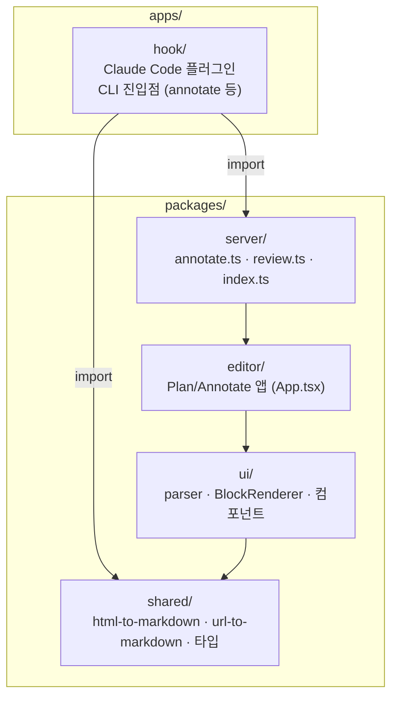

# 01. 프로젝트 개요

## Plannotator란?

**Plannotator**는 AI 코딩 에이전트(Claude Code, Codex, Copilot CLI, Gemini CLI, OpenCode, Kiro, Droid, Amp, Pi)를 위한 **로컬 브라우저 기반 리뷰 도구**다.

에이전트가 plan / markdown / HTML을 내놓거나 코드를 작성하면, 그 결과물이 브라우저에서 열린다. 사용자는 텍스트에 **코멘트·삭제선(redline)·라벨**을 달고, 그 피드백을 다시 에이전트에게 전달한다. 에이전트는 hook과 command를 통해 직접 연동된다.

주요 기능:
- **Plan Review** — 에이전트의 `ExitPlanMode`를 hook으로 가로채 plan을 리뷰
- **Code Review** — git/jj diff를 브라우저에서 리뷰
- **Annotate** — 임의의 markdown 파일, HTML 파일, URL, 폴더를 주석 대상으로 열기

이 문서 모음이 다루는 핵심 주제는 세 번째인 **Annotate** — 즉 *"Markdown을 annotation 가능한 HTML로 만드는 과정"*이다.

## 핵심 설계 철학

가장 중요한 통찰은 다음과 같다.

> **Markdown을 통째로 HTML 문자열로 변환하지 않는다.**
> 대신 Markdown을 **블록(Block) 단위로 분해**하고, 각 블록을 추적 가능한
> `data-block-id`를 가진 시맨틱 DOM 요소로 렌더링한 뒤,
> **`web-highlighter`로 텍스트 선택을 가로채** annotation을 입힌다.

단순 미리보기(markdown → HTML 한 방 변환)와의 차이는 다음과 같다.

| 항목 | 단순 미리보기 | Plannotator |
|------|---------------|-------------|
| 변환 단위 | 문서 전체 | 블록 단위 (문단/제목/리스트 항목 등) |
| 식별자 | 없음 | 블록마다 `data-block-id` |
| 선택 추적 | 불가 | 텍스트 + DOM 메타 기반으로 재현 가능 |
| 복원 | 불가 | 텍스트 검색으로 `<mark>` 재적용 |
| 출력 | HTML | 사람이 읽는 피드백 markdown (에이전트용) |

## 모노레포 구조 (조사 관련 부분만)



| 위치 | 역할 |
|------|------|
| `apps/hook/server/index.ts` | CLI 진입점. `annotate` 서브커맨드가 입력 타입을 감지·정규화 |
| `packages/server/annotate.ts` | Annotate 서버. `/api/plan`으로 콘텐츠를 프론트에 전달 |
| `packages/ui/utils/parser.ts` | `parseMarkdownToBlocks` — Markdown을 `Block[]`로 분해 |
| `packages/ui/components/BlockRenderer.tsx` | 각 `Block`을 `data-block-id`를 가진 DOM으로 렌더 |
| `packages/shared/html-to-markdown.ts` | HTML → Markdown 변환 (Turndown) |
| `packages/shared/url-to-markdown.ts` | URL → Markdown 변환 (Jina Reader / Turndown) |

## 연동 흐름 (Annotate)

```
사용자: /plannotator-annotate <file.md | file.html | https://... | folder/>
        ↓
CLI(annotate 서브커맨드)가 입력 타입 감지 → markdown 또는 raw HTML로 정규화
        ↓
Annotate 서버 시작 (plan editor HTML 재사용, mode:"annotate")
        ↓
브라우저 열림 → 블록 렌더링 → 사용자 annotation
        ↓
Send Annotations → 피드백을 에이전트 세션으로 전송
```

자세한 내용은 [02-pipeline.md](./02-pipeline.md)부터 이어진다.
