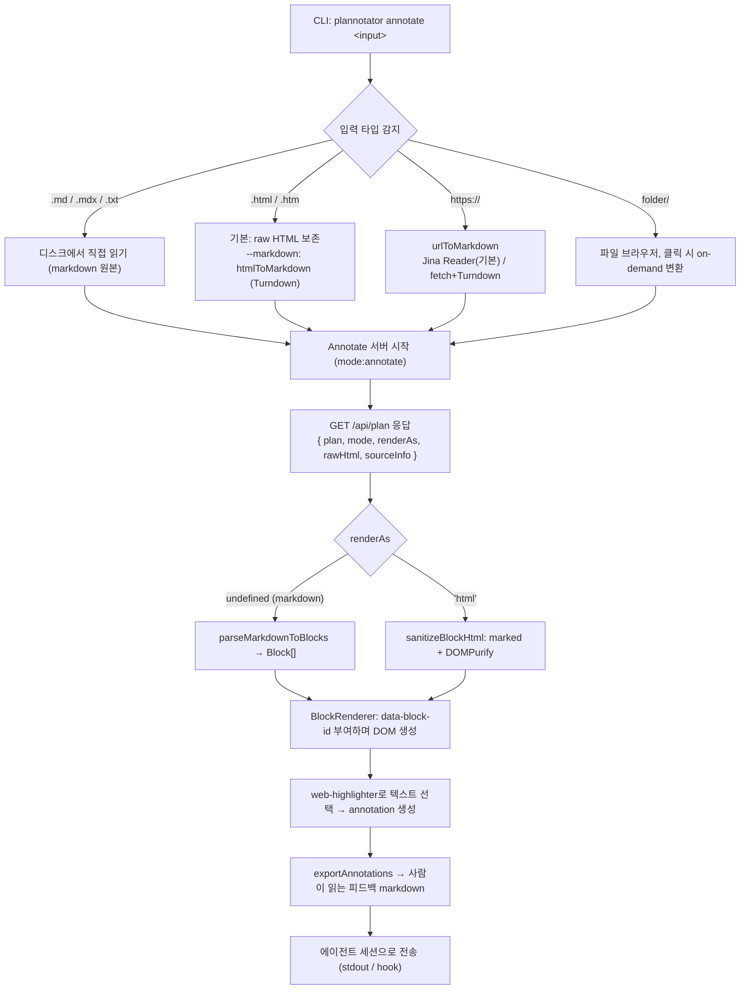

# 02. 전체 파이프라인

Markdown(또는 HTML/URL/폴더)이 annotation 가능한 화면이 되기까지의 전 과정이다.

## 전체 흐름도



## 단계 ① 입력 타입 정규화 (CLI, `apps/hook/server/index.ts`)

`annotate` 서브커맨드가 입력 종류를 판별해 **모두 일관된 형태로 정규화**한다.

| 입력 | 처리 | 변환기 | 결과 |
|------|------|--------|------|
| `.md` / `.mdx` / `.txt` | 디스크에서 그대로 읽음 | 없음 | `markdown` |
| `.html` / `.htm` | **기본은 raw HTML 보존**, `--markdown`이면 변환 | `htmlToMarkdown()` (Turndown) | `rawHtml` 또는 `markdown` |
| `https://...` | URL 페치 후 변환 | `urlToMarkdown()` — Jina Reader 우선, 실패 시 fetch+Turndown | `markdown` |
| `folder/` | 파일 브라우저, 클릭 시 변환 | 위 규칙 재사용 | 파일별 |

HTML 입력을 다루는 두 경로가 핵심이다.
- **raw HTML 모드** (`renderHtml: true`, `rawHtml` 전달): 원본 HTML을 변환 없이 보존해 그대로 렌더 → 원래 레이아웃 유지
- **변환 모드** (`--markdown`): Turndown으로 markdown화한 뒤 블록 파서를 태움 → 일관된 블록 단위 annotation

## 단계 ② Annotate 서버 (`packages/server/annotate.ts`)

Plan 리뷰 앱의 HTML을 **그대로 재사용**(`mode:"annotate"`)하면서 `/api/plan`으로 콘텐츠를 내려준다.

```ts
// GET /api/plan 응답
{
  plan,          // markdown 본문 (또는 raw HTML 모드일 때 표시용)
  origin,        // 호출한 에이전트 식별자 (claude-code 등)
  mode: "annotate",
  filePath,      // 원본 파일/URL 경로
  sourceInfo?,   // 출처 정보 (변환 여부 등)
  gate,          // 승인 게이트 여부
  renderAs?,     // 'html'이면 raw HTML 렌더, 없으면 markdown
  rawHtml?,      // raw HTML 모드일 때 원본 HTML
}
```

`renderAs === 'html'`이면 프론트는 raw HTML 경로로, 아니면 블록 파싱 경로로 분기한다.

## 단계 ③ 렌더링 (브라우저, `packages/ui`)

- **markdown 모드**: `parseMarkdownToBlocks(markdown)` → `Block[]` → `BlockRenderer`
- **html 모드**: `sanitizeBlockHtml()` (marked → DOMPurify) → `HtmlBlock`

자세한 내용은 [03-block-parsing-and-rendering.md](./03-block-parsing-and-rendering.md) 참고.

## 단계 ④ Annotation & Export

`web-highlighter`로 선택을 가로채 annotation을 만들고, `exportAnnotations()`로 사람이 읽을 수 있는 피드백 markdown을 생성해 에이전트에게 보낸다.

- annotation 메커니즘: [04-annotation-system.md](./04-annotation-system.md)
- 출력 데이터 형식: [05-output-format.md](./05-output-format.md)
