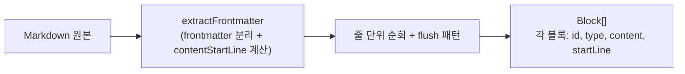
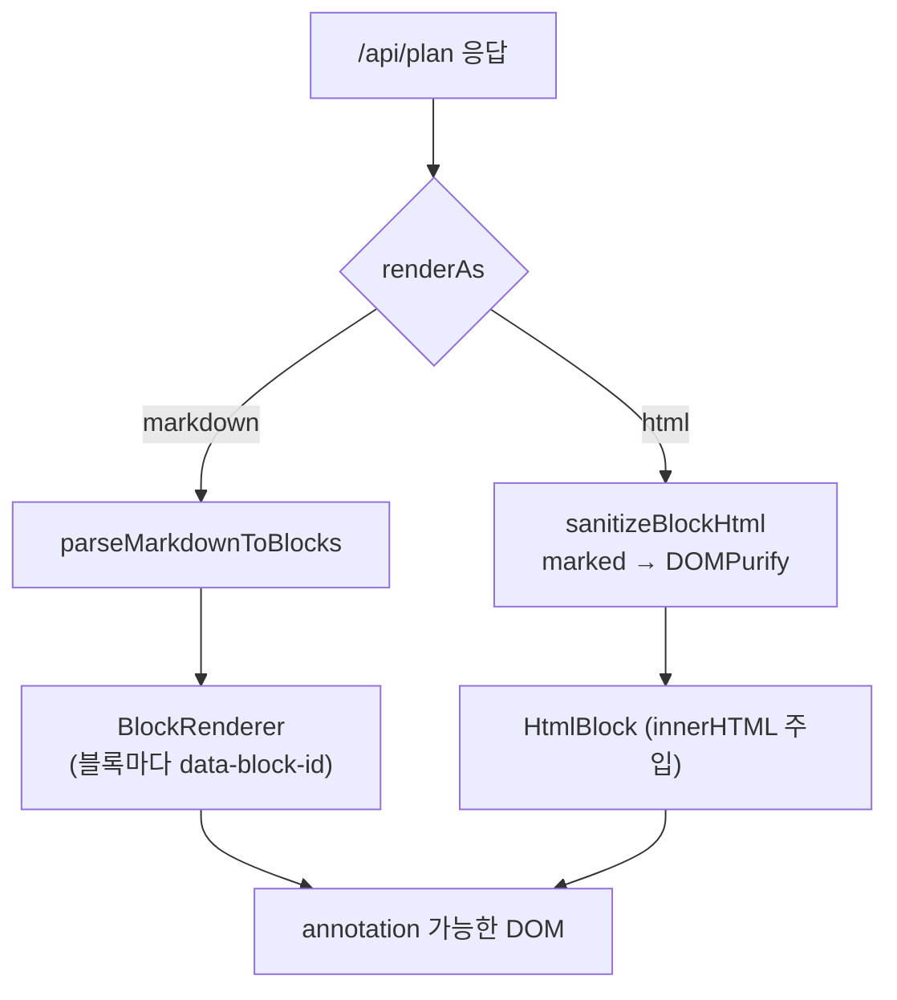

# 03. 블록 파싱과 렌더링

annotation의 토대가 되는 단계다. **"무엇을 annotation 가능한 HTML로 만드는가"**의 실제 구현이 여기에 있다.

## 핵심 데이터 구조: `Block`

`packages/ui/types.ts`

```ts
interface Block {
  id: string;        // "block-0", "block-1", ... (순차 부여)
  type: 'paragraph' | 'heading' | 'blockquote' | 'list-item'
      | 'code' | 'hr' | 'table' | 'html' | 'directive';
  content: string;   // 평문, 또는 type==='html'일 땐 원본(미정제) HTML
  level?: number;    // heading 1~6 / 리스트 들여쓰기 레벨
  language?: string; // 코드 블록 언어 (rust, typescript 등)
  checked?: boolean; // 체크박스 리스트 항목
  ordered?: boolean; // 순서 리스트 여부
  orderedStart?: number; // 순서 리스트 시작 번호
  alertKind?: 'note'|'tip'|'warning'|'caution'|'important'; // GitHub alert
  directiveKind?: string; // :::note 같은 directive 컨테이너
  order: number;     // 정렬 순서
  startLine: number; // 원본 1-based 줄 번호
}
```

## 단계 ① 파싱: `parseMarkdownToBlocks`

`packages/ui/utils/parser.ts`

Markdown을 한 줄씩 순회하며 `Block[]`로 분해한다. `flush()` 패턴으로 버퍼를 누적하다가 블록 경계를 만나면 비운다.

처리하는 요소:
- **Heading** (`#`~`######`) — slug 기반 anchor id 부여
- **Code block** (` ``` `) — 언어 추출
- **List item** (`-`, `*`, `1.`) — **각 항목을 독립 블록으로 분리** (정밀 annotation 목적)
- **Blockquote** (`>`) — GitHub alert(`> [!NOTE]` 등)는 `alertKind` 설정
- **Horizontal rule** (`---`, `***`)
- **Table** (파이프 구분)
- **Raw HTML block** (`<details>`, `<summary>` 등 — CommonMark §4.6 Type 6)
- **Directive container** (`:::kind ... :::`)
- **Paragraph** (기본) — 인라인 확장 포함



## 단계 ② 렌더링: `BlockRenderer`

`packages/ui/components/BlockRenderer.tsx`

각 `Block`을 **`data-block-id` / `data-block-type` 속성을 단 시맨틱 HTML 요소**로 변환한다. 인라인 요소는 `InlineMarkdown`이 처리한다.

```tsx
<h2 id={headingAnchorId} data-block-id={block.id} data-block-type="heading">
  <InlineMarkdown text={block.content} ... />
</h2>
```

블록 타입별 렌더 컴포넌트:

| Block type | 렌더 방식 |
|------------|-----------|
| heading | `<h1>`~`<h6>` + slug anchor id |
| paragraph | `<p>` + `InlineMarkdown` |
| list-item | 체크박스/순서/들여쓰기 반영 |
| code | `highlight.js`로 개별 하이라이팅 |
| table | `TableBlock` (markdown/CSV 복사, popout) |
| html | `HtmlBlock` — `sanitizeBlockHtml` (marked + DOMPurify) |
| directive / blockquote(alert) | `Callout` |
| (다이어그램) | `MermaidBlock`, `GraphvizBlock` |

이 **`data-block-id`가 "annotation 가능한 HTML"의 핵심**이다. annotation을 안정적으로 DOM에 부착·복원하는 앵커가 된다.

## 인라인 변환: `InlineMarkdown`

`packages/ui/components/InlineMarkdown.tsx`는 문단 내부의 인라인 요소를 직접 토큰화해 React 요소로 만든다. 지원하는 것:

- 굵게/기울임/취소선/인라인 코드
- `[label](url)`, ``, `<autolink>`
- bare URL 자동 링크 (`https://…`)
- `[[wiki-links]]`
- **hex color swatch** (`#fff`, `#123abc` → 색상 미리보기)
- `@mentions`, `#issue-refs`
- emoji shortcode (`:smile:`)
- smart punctuation (직선 따옴표 → 곡선 따옴표 등)
- backslash escape

링크 URL은 `sanitizeLinkUrl()`로 검증해 `javascript:` 등 위험 스킴을 차단한다.

## 렌더링 모드 분기 요약


