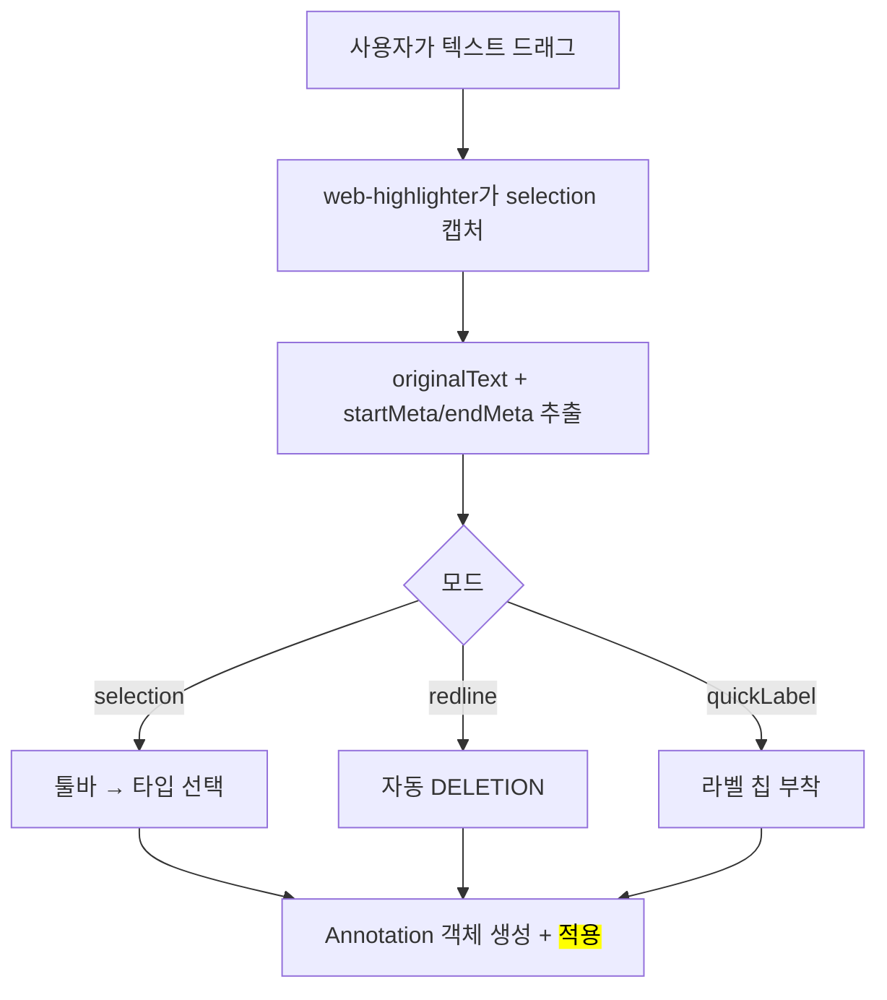

# 04. Annotation 시스템

렌더된 DOM 위에서 사용자가 텍스트를 선택해 주석을 다는 과정과, 그것을 복원·내보내는 메커니즘이다.

## Annotation 데이터 구조

`packages/ui/types.ts`

```ts
enum AnnotationType {
  DELETION = "DELETION",            // 삭제 요청 (redline)
  COMMENT = "COMMENT",              // 선택 텍스트에 대한 코멘트
  GLOBAL_COMMENT = "GLOBAL_COMMENT",// 문서 전체에 대한 일반 코멘트
}

interface Annotation {
  id: string;
  type: AnnotationType;
  text?: string;          // 코멘트 본문
  originalText: string;   // 선택된 실제 텍스트
  createdA: number;       // 타임스탬프
  author?: string;        // 협업 공유용 identity
  source?: string;        // 외부 도구 식별자 (예: "eslint")
  isQuickLabel?: boolean; // 퀵 라벨 칩으로 생성됐는지
  quickLabelTip?: string; // 라벨 정의의 지시 팁
  images?: ImageAttachment[]; // 첨부 이미지 (이름 + 경로)
  diffContext?: 'added' | 'removed' | 'modified'; // diff 뷰에서 생성 시

  // web-highlighter 메타데이터 (요소 간 선택 복원용)
  startMeta?: { parentTagName: string; parentIndex: number; textOffset: number };
  endMeta?:   { parentTagName: string; parentIndex: number; textOffset: number };
}
```

핵심은 annotation이 **단순 문자 오프셋이 아니라 "텍스트 + DOM 메타데이터"로 저장**된다는 점이다. 이 덕분에 요소가 재정렬되거나 다시 렌더돼도 복원이 가능하다.

## 부착(생성) 흐름

`packages/ui/hooks/useAnnotationHighlighter.ts` (Viewer가 사용)

- **선택 모드(selection)**: 텍스트 드래그 → 툴바 등장 → 타입 선택(코멘트/삭제/전역)
- **레드라인 모드(redline)**: 드래그 시 자동으로 `DELETION` annotation 생성
- **퀵 라벨 모드(quickLabel)**: 미리 정의된 라벨 칩으로 즉시 부착

텍스트 하이라이팅은 `web-highlighter` 라이브러리가 담당한다.



## 복원 흐름 (공유 URL 로드 등)

저장된 오프셋이 없으므로 **DOM에서 텍스트를 검색해 위치를 다시 찾는다.**


## 코드 블록 예외 처리

`web-highlighter`는 `<pre>` 내부 선택을 지원하지 못한다. 따라서 **코드 블록은 수동 `<mark>` 래핑**으로 별도 처리한다.

## 출력으로의 연결

생성된 annotation들은 블록 정보와 함께 `exportAnnotations()`로 직렬화되어 사람이 읽을 수 있는 피드백 markdown이 된다. 자세한 형식은 [05-output-format.md](./05-output-format.md) 참고.
