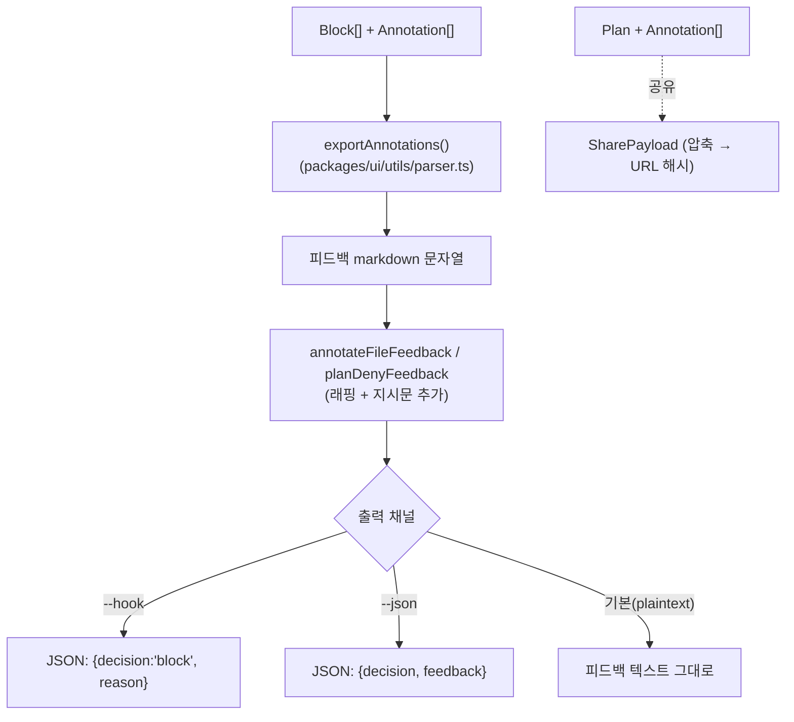
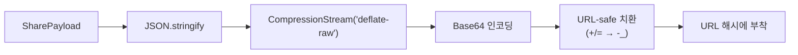

# 05. 출력 데이터 형식

annotation 작업의 최종 산출물은 **사람이 읽을 수 있는 피드백 markdown**이며, 이를 stdout/hook을 통해 에이전트에게 전달한다. 여기에 더해 공유용 압축 페이로드 형식도 존재한다.

## 출력 데이터 흐름



## ① `exportAnnotations()` — 피드백 markdown 생성

`packages/ui/utils/parser.ts`. 블록과 annotation을 사람이 읽을 수 있는 markdown으로 직렬화한다.

규칙:
- annotation을 **블록 순서 → 오프셋 순**으로 정렬
- 각 annotation에 **원본 줄 번호 라벨** 부여 (`(line 12)` 또는 `(lines 12–15)`)
- diff 뷰에서 만든 annotation은 라벨 대신 `[In diff content]`
- HTML/URL 변환 소스이면 상단에 *"줄 번호는 변환된 markdown 기준"* 경고 추가
- 이미지는 **이름 + 경로**로 참조 (`[image-name] \`/tmp/path...\``)
- 퀵 라벨이 있으면 마지막에 **Label Summary** 집계

### 출력 예시

````markdown
# Plan Feedback

I've reviewed this plan and have 3 pieces of feedback:

## 1. (line 5) Remove this
```
이 문장은 빼주세요
```
> I don't want this in the plan.

## 2. (lines 12–15) Feedback on: "기존 인증 로직"
> JWT 대신 세션 기반으로 바꿔주세요.

## 3. [security] Feedback on: "API 키를 코드에 하드코딩"
> 환경변수로 옮겨야 합니다.

## 4. General feedback about the plan
> 전체적으로 에러 처리가 부족합니다.
**Attached images:**
- [error-screenshot] `/tmp/plannotator-xxx/error.png`

---

## Label Summary

- **security**: 1
````

### 타입별 출력 포맷

| 타입 | 출력 형태 |
|------|-----------|
| `DELETION` | `Remove this` + 코드펜스로 원본 텍스트 + `> I don't want this...` |
| `COMMENT` | `Feedback on: "<원본>"` + `> <코멘트>` |
| `COMMENT` (퀵 라벨) | `[<라벨>] Feedback on: "<원본>"` + `> <팁>` |
| `GLOBAL_COMMENT` | `General feedback about the <subject>` + `> <코멘트>` |

annotation이 하나도 없으면 `"No changes detected."`를 반환한다.

## ② 피드백 래핑 (`packages/shared/feedback-templates.ts`)

생성된 피드백 본문에 에이전트용 지시문을 덧붙인다.

**annotate (파일 주석)** — `annotateFileFeedback()`:
```markdown
# Markdown Annotations

File: <filePath>

<exportAnnotations 결과>

Please address the annotation feedback above.
```

**plan 거부** — `planDenyFeedback()`:
```markdown
YOUR PLAN WAS NOT APPROVED.

You MUST revise the plan to address ALL of the feedback below before calling ExitPlanMode again.

Rules:
- Do not resubmit the same plan unchanged.
- Do NOT change the plan title (first # heading) unless the user explicitly asks you to.

<exportAnnotations 결과>
```

> 참고: deny 템플릿은 강한 명령형 어조를 일부러 사용한다. 부드러운 표현은 에이전트가 무시하는 경향이 있어 튜닝된 결과다.

## ③ stdout 출력 매트릭스 (`apps/hook/server/index.ts`)

호출 플래그에 따라 출력 채널이 달라진다.

| 모드 | Approve/Close | Annotate(피드백 있음) |
|------|---------------|------------------------|
| `--hook` | 빈 stdout (hook 통과) | `{"decision":"block","reason":"<feedback>"}` |
| `--json` | `{"decision":"approved"}` / `{"decision":"dismissed"}` | `{"decision":"annotated","feedback":"..."}` |
| 기본(plaintext) | 빈 출력 / `"The user approved."` | 피드백 텍스트 그대로 |

> `--hook`은 Claude Code와 Codex hook 프로토콜 모두와 호환된다.
> plaintext의 승인 sentinel `"The user approved."`는 slash command 템플릿이 문자열로 매칭하므로 **정확히 그 문자열을 유지**해야 한다.

## ④ 공유 페이로드 형식 (`SharePayload`)

`packages/ui/utils/sharing.ts`. plan + annotation을 URL 해시로 공유할 때 쓰는 압축 페이로드다.

```ts
interface SharePayload {
  p: string;                 // Plan markdown
  a: ShareableAnnotation[];  // 압축된 annotation
  g?: ShareableImage[];      // 전역 첨부 이미지
  d?: (string | null)[];     // diffContext (a와 병렬)
  s?: (string | undefined)[];// source 외부도구 식별자 (a와 병렬)
  h?: string;                // raw HTML 내용 (HTML 렌더 모드)
  r?: 'html';                // 렌더 모드 플래그 (생략 시 markdown)
}

// 이미지: 문자열(구버전) 또는 [경로, 이름] 튜플(신버전)
type ShareableImage = string | [string, string];

// annotation 압축 표현 (타입 약어로 시작)
type ShareableAnnotation =
  | ["D", string, string | null, ShareableImage[]?]          // [type, original, author, images?]
  | ["C", string, string, string | null, ShareableImage[]?]  // [type, original, comment, author, images?]
  | ["G", string, string | null, ShareableImage[]?];         // [type, comment, author, images?]
```

**압축 파이프라인:**



큰 plan은 paste 서비스를 통해 짧은 URL로 만든다(사용자가 명시적으로 확인해야 함).
