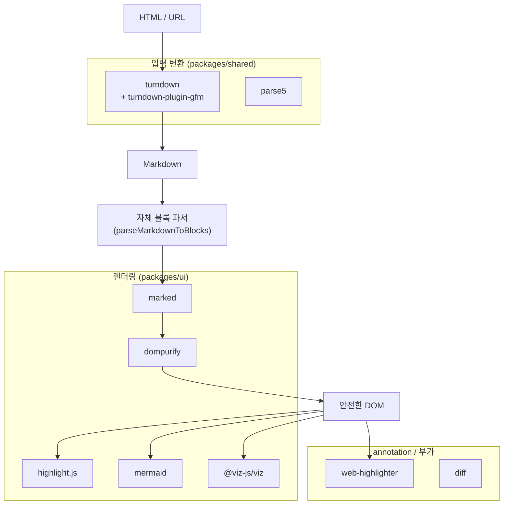

# 06. 변환에 사용하는 외부 라이브러리

Markdown ↔ HTML 변환 및 렌더링·annotation에 쓰이는 주요 외부 라이브러리를 정리한다.

## 변환·렌더링 핵심 라이브러리

| 라이브러리 | 버전 | 위치 | 역할 |
|------------|------|------|------|
| **turndown** | ^7.2.4 | `packages/shared` | **HTML → Markdown** 변환 엔진 |
| **@joplin/turndown-plugin-gfm** | ^1.0.64 | `packages/shared` | Turndown에 GFM(테이블/취소선/태스크리스트) 지원 추가 |
| **parse5** | ^7.3.0 | `packages/shared` | HTML 파싱 (DOM 트리 구성) |
| **marked** | ^17.0.6 | `packages/ui` | **Markdown → HTML** (raw HTML 블록·인라인 정제 시) |
| **dompurify** | (ui) | `packages/ui` | HTML **새니타이징** (XSS 방지) |
| **@plannotator/web-highlighter** | ^0.8.1 | `packages/ui` | 텍스트 선택 → annotation 하이라이팅 (web-highlighter 포크) |
| **highlight.js** | ^11.11.1 | `packages/ui` | 코드 블록 **구문 강조** |
| **mermaid** | ^11.12.2 | `packages/ui` | Mermaid 다이어그램 렌더 |
| **@viz-js/viz** | ^3.25.0 | `packages/ui` | Graphviz(DOT) 다이어그램 렌더 |
| **diff** | ^8.0.3 | `packages/ui` | plan 버전 간 라인 단위 diff |

## 역할별 분류

## 보조 라이브러리

| 라이브러리 | 역할 |
|------------|------|
| **react / react-dom** (^19) | UI 프레임워크 |
| **@codemirror/** 계열 | 인라인 markdown 에디터(직접 편집 모드)의 코드 편집 |
| **@atomic-editor/editor**, **@plannotator/markdown-editor** | markdown 에디터 |
| **@radix-ui/** 계열 | 다이얼로그·팝오버·툴팁 등 UI 프리미티브 |
| **@tanstack/react-table** | 테이블 블록 렌더 |
| **perfect-freehand** | 이미지 annotation 자유선 그리기 |
| **motion** | 애니메이션 |

## 주목할 선택

- **Markdown → 블록 분해는 외부 라이브러리(marked)가 아니라 자체 파서를 쓴다.** marked는 인라인 정제와 raw HTML 블록 렌더에만 제한적으로 사용된다. 그 이유는 [07-notable-points.md](./07-notable-points.md) 참고.
- **HTML → Markdown은 Turndown + GFM 플러그인** 조합으로, GitHub 스타일 테이블/태스크리스트를 보존한다.
- **새니타이징은 항상 DOMPurify**를 거친다. raw HTML 블록은 `marked.parse()` 후 DOMPurify 허용 목록으로 필터링된다.
