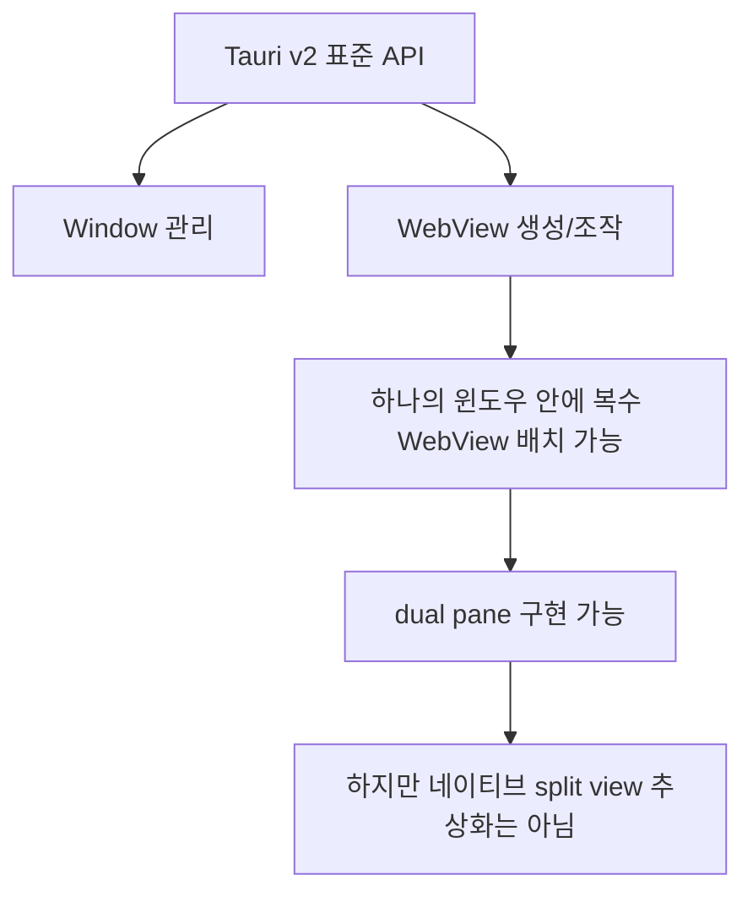
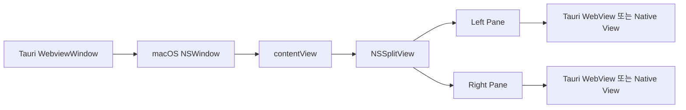
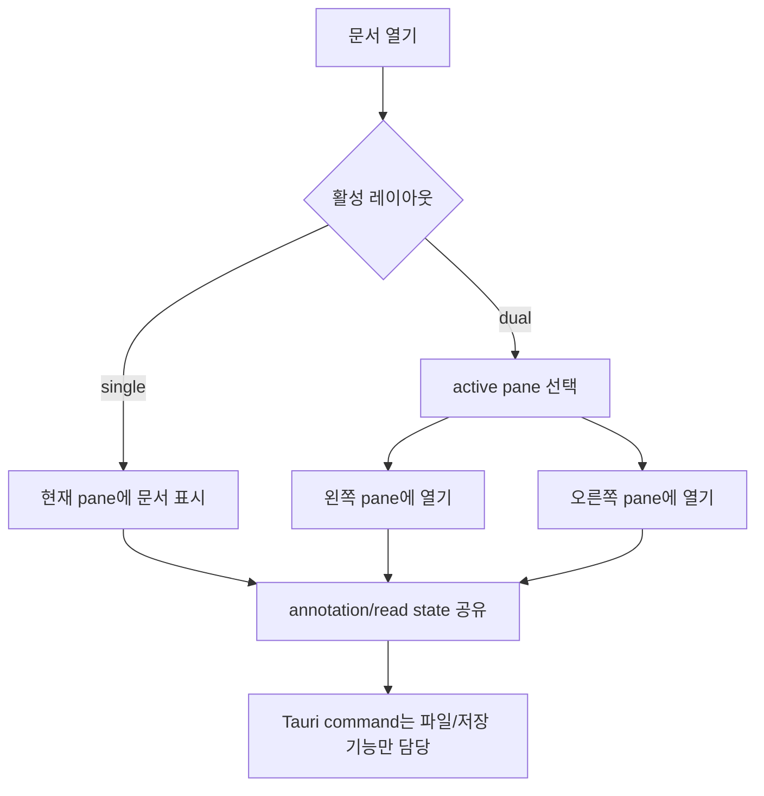
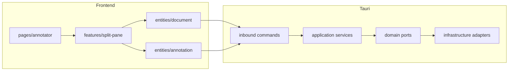

# Tauri Native Dual Pane 조사

## 결론

Tauri에는 macOS 네이티브 탭/윈도우처럼 하나의 윈도우를 dual pane으로 관리하는 cross-platform 네이티브 추상화가 없다.

Markdown Annotator에서 dual pane을 제공하려면 기본 전략은 React/HTML 레이아웃으로 split pane을 구현하는 것이다. Tauri v2의 multi-webview 기능은 하나의 네이티브 윈도우 안에 여러 WebView를 배치할 수 있는 기반이지만, 운영체제의 네이티브 split view 컨트롤을 그대로 노출하는 기능은 아니다. macOS에서만 네이티브 분할 뷰가 필요하다면 AppKit의 `NSSplitView`/`NSSplitViewController`를 `objc2-app-kit` 또는 별도 Tauri plugin으로 감싸는 방식이 가능하지만, 플랫폼 종속성과 유지보수 비용이 크다.

## 조사 범위

- Tauri v2 표준 API에서 dual pane 또는 split view에 해당하는 기능이 있는지 확인
- macOS AppKit에서 제공하는 네이티브 split view 기능 확인
- Tauri에서 AppKit split view를 사용할 수 있는 외부 구현 가능성 확인
- Markdown Annotator의 현재 멀티 윈도우/네이티브 탭 전략과 함께 사용할 수 있는 방향 정리

## 선택지 요약

| 선택지 | 플랫폼 | 구현 위치 | 장점 | 단점 | 권장도 |
| --- | --- | --- | --- | --- | --- |
| React/HTML split pane | 전체 플랫폼 | Frontend | 구현이 단순하고 현재 앱 구조와 잘 맞음 | OS 네이티브 split view는 아님 | 높음 |
| Tauri multi-webview | 전체 플랫폼 | Tauri + Frontend | pane마다 WebView를 분리할 수 있음 | pane 레이아웃, 리사이즈, 상태 동기화를 직접 관리해야 함 | 중간 |
| macOS `NSSplitView` | macOS 전용 | Tauri native adapter | macOS 네이티브 분할 뷰 사용 가능 | AppKit view hierarchy 제어가 필요하고 cross-platform 불가 | 낮음 |
| `tauri-nssplitview` plugin | macOS 전용 | 외부 plugin | 기존 실험 구현을 참고 가능 | 성숙도와 유지보수 상태 검토 필요 | 낮음 |

## Tauri 표준 API 검토

Tauri v2는 `Webview` API를 통해 WebView를 생성하고 조작할 수 있다. 공식 문서는 WebView 생성, 현재 WebView 핸들 접근, WebView 간 이벤트 통신을 제공한다고 설명한다.

하지만 이 API는 운영체제의 split view 컨트롤을 제공하는 것이 아니라, Tauri 윈도우 내부에 WebView를 다루는 저수준 기반에 가깝다. 따라서 dual pane을 만들 수는 있지만 다음 책임은 애플리케이션이 직접 가진다.

- pane 영역 계산
- divider 드래그와 리사이즈
- 최소/최대 크기 제약
- pane focus와 keyboard routing
- 문서 상태 동기화
- pane 생성/닫기/교체 lifecycle

## macOS 네이티브 기능 검토

macOS AppKit에는 `NSSplitView`와 `NSSplitViewController`가 있다. Apple 문서 기준으로 `NSSplitViewController`는 여러 child view를 좌우 또는 상하로 배치하는 split view를 관리하고, `NSSplitView`는 divider와 방향을 관리한다.

Tauri에서 이를 사용하려면 Tauri가 만든 `NSWindow`의 content view hierarchy에 AppKit split view를 삽입하고, 각 pane에 Tauri WebView 또는 네이티브 view를 배치해야 한다. 이 방식은 네이티브 동작에 가장 가깝지만 다음 문제가 있다.

- macOS 전용 구현이다.
- Tauri의 WebViewWindow 추상화 밖에서 AppKit view hierarchy를 다뤄야 한다.
- pane lifecycle이 Tauri window lifecycle과 다르게 움직일 수 있다.
- Windows/Linux에서는 별도 구현 또는 fallback이 필요하다.
- 현재 프로젝트의 hexagonal backend 경계와 frontend 상태 관리 경계를 더 엄격하게 설계해야 한다.

## 외부 구현: tauri-nssplitview

`tauri-nssplitview`는 Tauri 앱에서 macOS `NSSplitView`를 사용하기 위한 wrapper plugin이다. README 기준으로 표준 Tauri WebView와 네이티브 macOS split view 기능을 함께 쓰는 hybrid 앱을 목표로 한다.

다만 현재 Markdown Annotator의 기본 전략으로 채택하기에는 다음 검토가 필요하다.

- 릴리스 및 유지보수 상태
- Tauri v2 최신 버전과의 호환성
- `macos-private-api` 필요 여부
- App Store 배포 정책 영향
- pane 안의 문서 상태, focus, 단축키, drag/drop 처리 방식

따라서 이 plugin은 즉시 도입 대상이라기보다 macOS 전용 proof of concept 또는 참고 구현으로 보는 것이 적절하다.

## Markdown Annotator 권장 전략

현재 목표가 네이티브 탭/윈도우 기반의 문서 작업이라면 dual pane은 네이티브 창 관리와 분리해서 앱 내부의 문서 레이아웃 기능으로 다루는 편이 안전하다.

권장 순서는 다음과 같다.

1. React/HTML split pane으로 dual pane UX를 먼저 구현한다.
2. pane은 하나의 윈도우 안에서 문서 view model 두 개를 관리하는 방식으로 시작한다.
3. divider 위치, active pane, 열린 문서 경로는 frontend 상태로 관리한다.
4. 파일 열기, 저장, annotation persistence는 기존 Tauri command와 domain/application 계층을 재사용한다.
5. macOS 네이티브 `NSSplitView`는 별도 feature flag 또는 실험 브랜치에서만 검증한다.

## 구현 시 고려 사항

- dual pane은 윈도우/탭과 다른 축의 상태다. `Window -> Tab -> Pane -> Document` 또는 `Window -> Pane -> Tab -> Document` 중 어떤 모델을 쓸지 먼저 정해야 한다.
- 네이티브 탭이 있는 macOS에서는 한 탭 안에 dual pane이 들어가는 모델이 자연스럽다.
- 단축키는 `Cmd+1`, `Cmd+2` 같은 pane focus 전환과 `Cmd+Shift+\\` 같은 split toggle을 별도로 정의할 수 있다.
- annotation selection, scroll sync, preview mode는 pane별 상태와 문서별 상태를 분리해야 한다.
- pane divider 위치는 window별 UI preference로 저장하고, 문서 데이터에는 저장하지 않는다.

## 권장 아키텍처 초안

`features/split-pane`은 pane 배치, divider 조작, active pane 전환만 담당한다. 문서 로딩과 annotation 저장은 기존 `entities/document`, `entities/annotation` 흐름을 재사용해야 한다. 이렇게 하면 나중에 macOS 네이티브 split view 실험을 하더라도 문서 도메인 로직은 유지할 수 있다.

## 참고 자료

- Tauri v2 WebView API: <https://v2.tauri.app/reference/javascript/api/namespacewebview/>
- Apple `NSSplitViewController`: <https://developer.apple.com/documentation/AppKit/NSSplitViewController>
- Apple `NSSplitView`: <https://developer.apple.com/documentation/appkit/nssplitview>
- `tauri-nssplitview`: <https://github.com/Vanalite/tauri-nssplitview>
