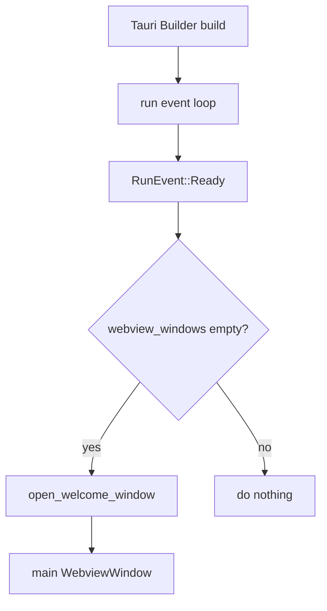
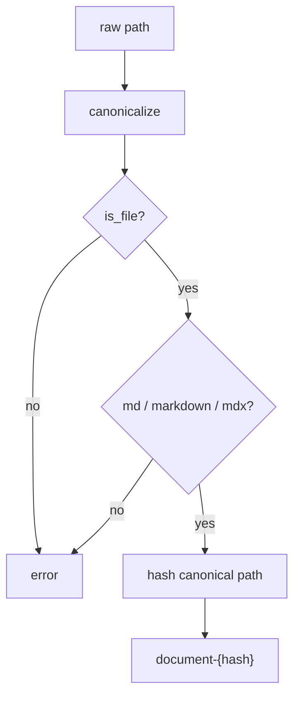
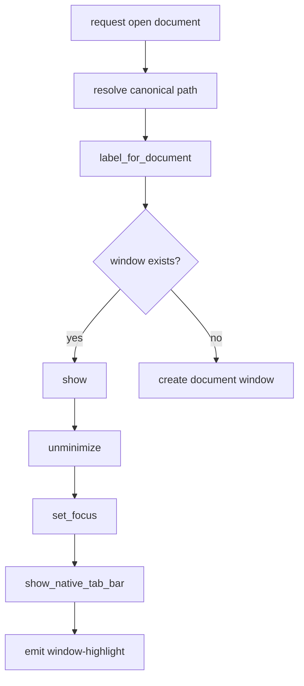
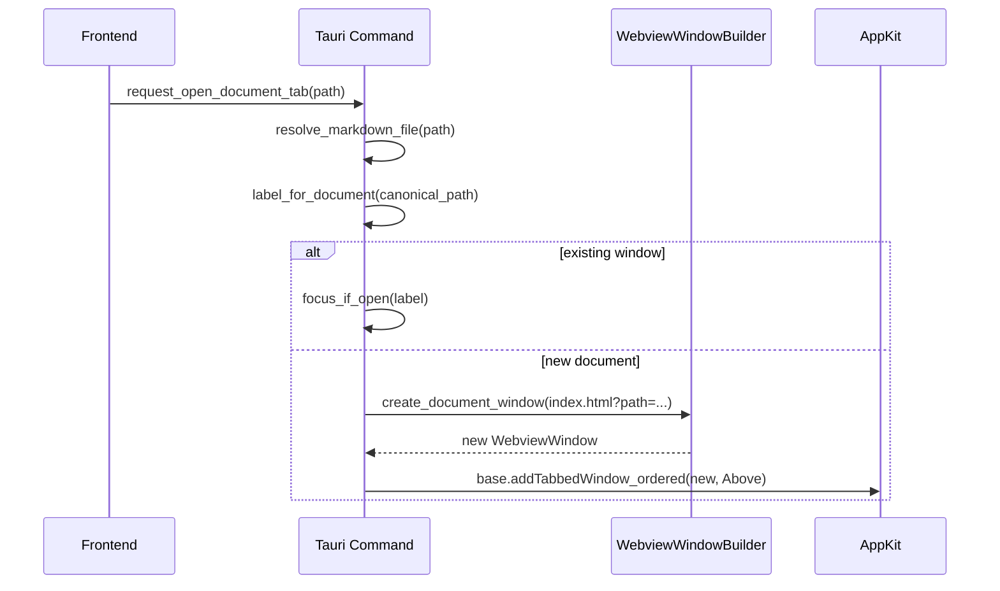
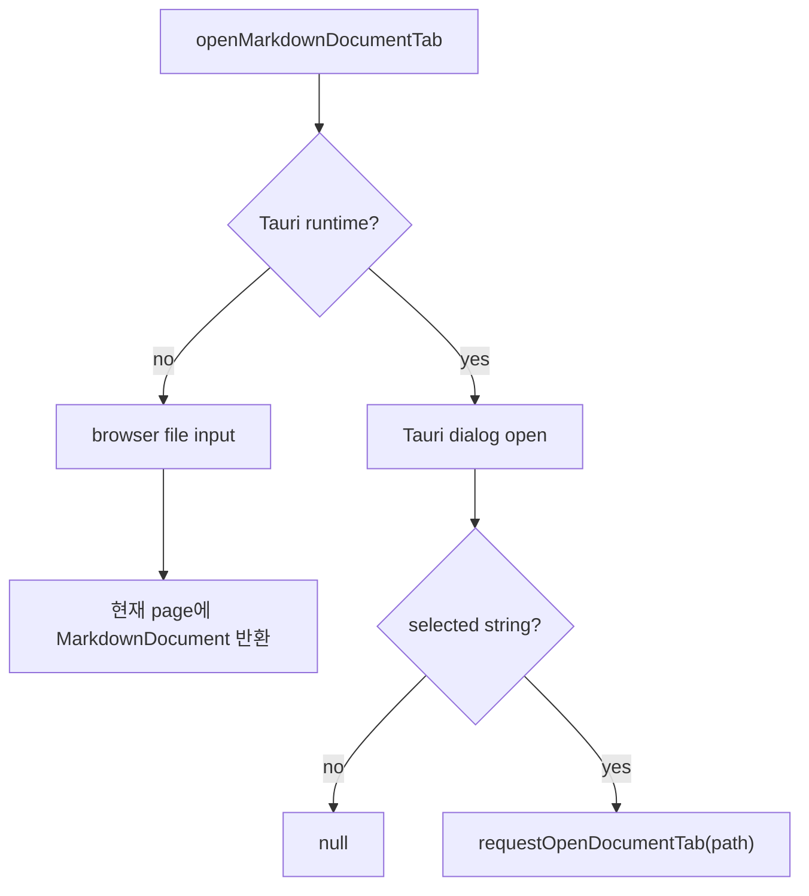

# Tauri Native 창 관리 구현

## 개요

Markdown Annotator는 Tauri의 정적 window 설정을 사용하지 않고, Rust 코드에서 native window를 직접 생성한다. Markdown 문서는 독립 window 또는 macOS native tab으로 열린다.

이 문서는 현재 구현된 native 창 관리 방식, command 흐름, macOS native tab 처리, 프론트엔드 연동 지점을 설명한다.

## 핵심 설계

### 정적 window 제거

`apps/markdown-annotator/src-tauri/tauri.conf.json`의 `app.windows`는 빈 배열이다.

```json
{
  "app": {
    "windows": []
  }
}
```

앱 시작 시 Tauri가 자동으로 window를 만들지 않는다. 대신 `RunEvent::Ready`에서 열린 window가 없을 때 Rust가 welcome window를 만든다.



### Command 중심 창 관리

현재 backend command는 다음 세 가지다.

| Command | 역할 |
| --- | --- |
| `read_markdown_file` | Markdown 파일을 읽어 프론트엔드 문서 모델로 반환한다. |
| `request_open_document_window` | Markdown 파일을 독립 native window로 연다. |
| `request_open_document_tab` | Markdown 파일을 새 native window로 만든 뒤 현재 macOS tab group에 붙인다. |

프론트엔드의 일반 `Open` 동작은 `request_open_document_tab`을 사용한다. 즉 사용자가 문서를 열면 현재 window의 native tab group에 새 문서가 붙는다.

## 파일 경로와 Window Label

문서를 열 때 backend는 먼저 경로를 검증한다.

1. 전달받은 path를 `canonicalize`한다.
2. 실제 파일인지 확인한다.
3. 확장자가 `md`, `markdown`, `mdx`인지 확인한다.
4. canonical path를 hash하여 deterministic window label을 만든다.



같은 파일은 항상 같은 label을 갖는다. 그래서 중복 문서 여부는 `app.get_webview_window(label)`로 판단한다.

## Document Window 생성

새 문서 window는 `WebviewWindowBuilder`로 생성한다.

```rust
let encoded_path = utf8_percent_encode(&path.to_string_lossy(), NON_ALPHANUMERIC).to_string();
let url = format!("index.html?path={encoded_path}");

WebviewWindowBuilder::new(app, label, WebviewUrl::App(url.into()))
    .title(title)
    .inner_size(1280.0, 860.0)
    .min_inner_size(980.0, 680.0)
```

문서 경로는 이벤트 payload가 아니라 URL query로 전달한다.

장점:

- 새 window가 프론트엔드 이벤트 구독 전에 `open-document` 이벤트를 놓치는 race condition이 없다.
- 새 window는 `window.location.search`만 읽으면 자신이 표시할 문서를 알 수 있다.
- window reload 후에도 동일 query path로 문서를 다시 로드할 수 있다.

## 기존 Window 포커스

같은 문서가 이미 열려 있으면 새 window를 만들지 않는다.



프론트엔드는 `markdown-annotator://window-highlight` 이벤트를 받아 상태 메시지를 갱신한다.

## macOS Native Tab 처리

### Tabbing Identifier

macOS에서는 welcome window와 모든 document window에 같은 tabbing identifier를 지정한다.

```rust
#[cfg(target_os = "macos")]
{
    builder = builder.tabbing_identifier("markdown-annotator");
}
```

같은 identifier를 가진 `NSWindow`는 macOS native tab group에 참여할 수 있다.

### 현재 Window에 새 Tab 붙이기

`request_open_document_tab`은 다음 순서로 동작한다.



macOS 구현은 `objc2-app-kit`의 `NSWindow.addTabbedWindow_ordered`를 사용한다.

```rust
base_ns_window.addTabbedWindow_ordered(new_ns_window, NSWindowOrderingMode::Above);
```

Windows/Linux에서는 같은 command가 일반 새 window 생성으로 동작한다. macOS AppKit 코드는 `#[cfg(target_os = "macos")]`로 격리한다.

### 단일 Window Native Tab Bar 표시

요구사항상 단일 window 상태에서도 native tab bar가 보여야 한다. 그래야 사용자가 현재 window의 tab을 다른 window로 드래그해 병합할 수 있다.

현재 구현은 window 생성 직후와 기존 window focus 시 `show_native_tab_bar`를 호출한다.

```rust
if ns_window
    .tabGroup()
    .map(|tab_group| tab_group.isTabBarVisible())
    .unwrap_or(false)
{
    return;
}

ns_window.toggleTabBar(None);
```

주의:

- 이 동작은 macOS AppKit에 의존한다.
- Tauri/wry 조합에서는 macOS 버전과 window 상태에 따라 단일 window tab bar 표시가 제한될 수 있다.
- 표시가 실패하는 환경에서는 hidden helper tab 또는 별도 AppKit 보조 전략을 검토해야 한다.

## 프론트엔드 연동

### API Adapter

`entities/document/api/documentApi.ts`는 backend command를 감싼다.

```ts
export function readMarkdownDocument(path: string): Promise<MarkdownDocument>;
export function requestOpenDocumentWindow(path: string): Promise<void>;
export function requestOpenDocumentTab(path: string): Promise<void>;
```

### 파일 열기 Feature

`features/open-document/openMarkdownDocument.ts`는 런타임에 따라 다르게 동작한다.



### Query 기반 문서 로딩

`AnnotatorPage`는 mount 시 query string에서 `path`를 읽는다.

```ts
new URLSearchParams(window.location.search).get("path")
```

`path`가 있으면 `readMarkdownDocument(path)`로 문서를 읽고, 현재 window의 annotation/selection/dialog 상태를 초기화한다.

## 권한 설정

동적 window label을 사용하므로 capability의 window 범위는 `["*"]`다.

```json
{
  "windows": ["*"],
  "permissions": [
    "core:default",
    "dialog:allow-open",
    "allow-read-markdown-file"
  ]
}
```

custom permission은 다음 command를 허용한다.

```toml
commands.allow = [
  "read_markdown_file",
  "request_open_document_tab",
  "request_open_document_window"
]
```

## 검증 항목

자동 검증:

```bash
pnpm --filter @yoophi/markdown-annotator check-types
pnpm --filter @yoophi/markdown-annotator build
cd apps/markdown-annotator/src-tauri && cargo check
```

수동 검증:

1. 앱을 실행한다.
2. welcome window에 native tab bar가 표시되는지 확인한다.
3. `Open`으로 Markdown 파일 A를 연다.
4. 파일 A가 현재 macOS native tab group에 붙는지 확인한다.
5. 파일 B를 열어 두 번째 문서 tab이 생기는지 확인한다.
6. tab을 드래그해 별도 window로 분리한다.
7. 분리된 단일 window에도 native tab bar가 표시되는지 확인한다.
8. 분리된 window의 tab을 다른 Markdown Annotator window로 드래그해 병합한다.
9. 이미 열린 파일을 다시 열면 새 tab/window가 생기지 않고 기존 window가 포커스되는지 확인한다.

## 향후 개선

- native menu `Cmd+T`를 `request_open_document_tab` 흐름에 연결한다.
- `Open in New Window` 메뉴를 추가해 `request_open_document_window`를 사용자에게 노출한다.
- CLI `ma <filename>`에서 같은 deterministic label과 focus 정책을 재사용한다.
- 단일 window native tab bar 표시가 실패하는 macOS/Tauri 조합에 대한 fallback을 설계한다.
